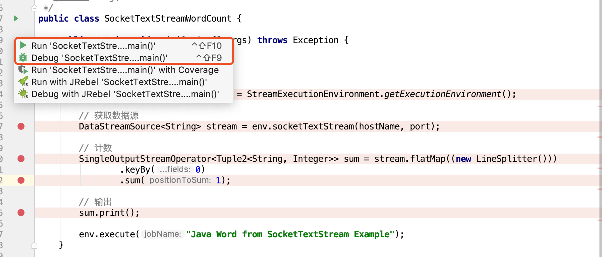
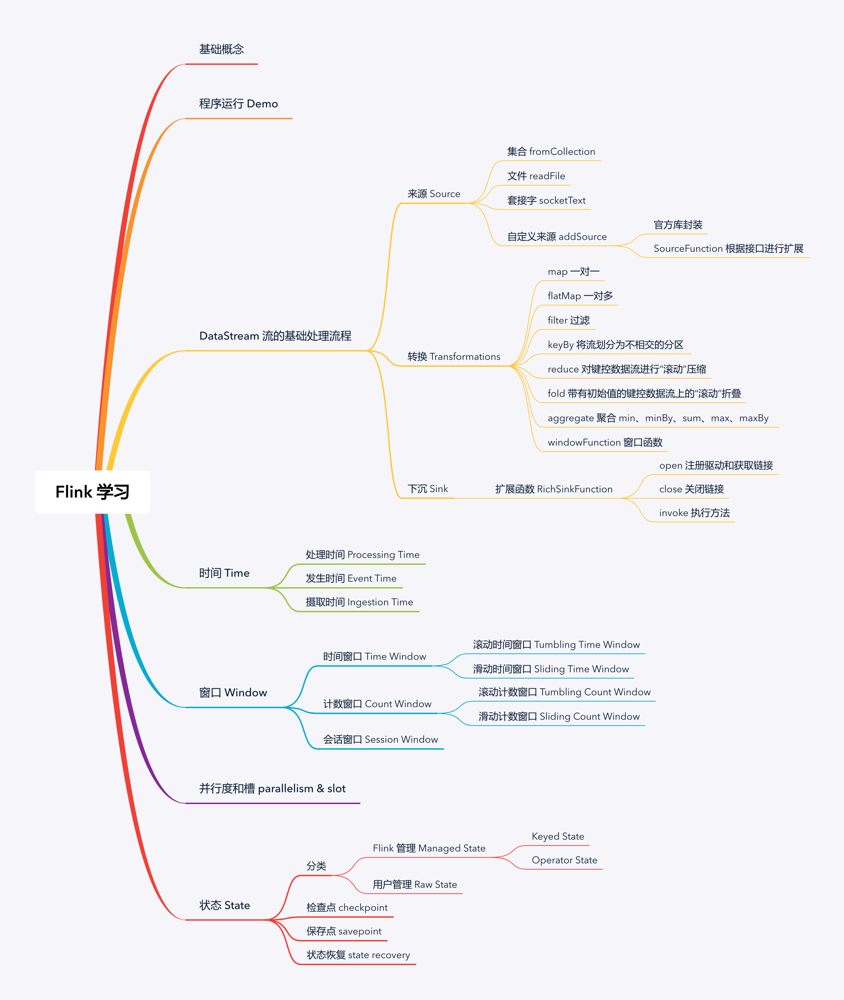

<h1 align="center">Welcome to flink-learning-note 👋</h1>
<p>
  
  
  <a href="https://juejin.im/user/58782b471b69e6005823ab38">
    
  </a>
</p>

> Flink 流式计算框架学习笔记

**一直对流式计算引擎感兴趣，于是一边学习，一边总结知识点，加深理解**

**同时由于个人技术有限，出现理解错误或者有疑问的地方，可在掘金文章下留言，期待朋友们的反馈~**


### 🏠 [工程地址](https://github.com/Vip-Augus/flink-learning-note)

## 下载源码

```sh
git clone https://github.com/Vip-Augus/flink-learning-note
```

## 代码执行



## 传送门：

- [Flink 基础学习(一)初识和基础概念](note/2019-10-10-flink_learn_introduction.md)

- [Flink 基础学习(二)搭建一个 "Hello World" 程序](note/2019-10-13-flink_learn_hello_world.md)

- [Flink 基础学习(三)数据源 DataSource](note/2019-10-24-flink_learn_datasource.md)

- [Flink 基础学习(四)数据转换 Transformation](note/2019-11-12-flink_learn_transformation.md)

- [Flink 基础学习(五)数据存储 DataSink](note/2019-11-21-flink_learn_datasink.md)

- [Flink 基础学习(六)时间 Time 和 Watermark](note/2019-11-27-flink_learn_time.md)

- [Flink 基础学习(七)窗口 Window](note/2019-12-01-flink_learn_window.md)


## 关于我

👤 **JingQ**

* Github: [@Vip-Augus](https://github.com/Vip-Augus)
* JueJin: [@Vip-Augus](https://juejin.im/user/58782b471b69e6005823ab38)
* Github page : [JingQ](http://vip-augus.github.io)

## :orange_book: 参考资料

- [`Flink` 官网](https://ci.apache.org/projects/flink/flink-docs-release-1.9/)
- [`Vererica` 国内牛人的分享](https://ververica.cn)
- [`Github 项目`](https://github.com/apache/flink)
- [`zhisheng`](http://www.54tianzhisheng.cn/tags/Flink/)
- [`wuchong`](http://wuchong.me/categories/Flink/)


## 知识点



## 点个小星星✨

**如果觉得这个项目不错，请点个小星星，蟹蟹你的鼓励~**

***
_This README was generated with ❤️ by [readme-md-generator](https://github.com/kefranabg/readme-md-generator)_
