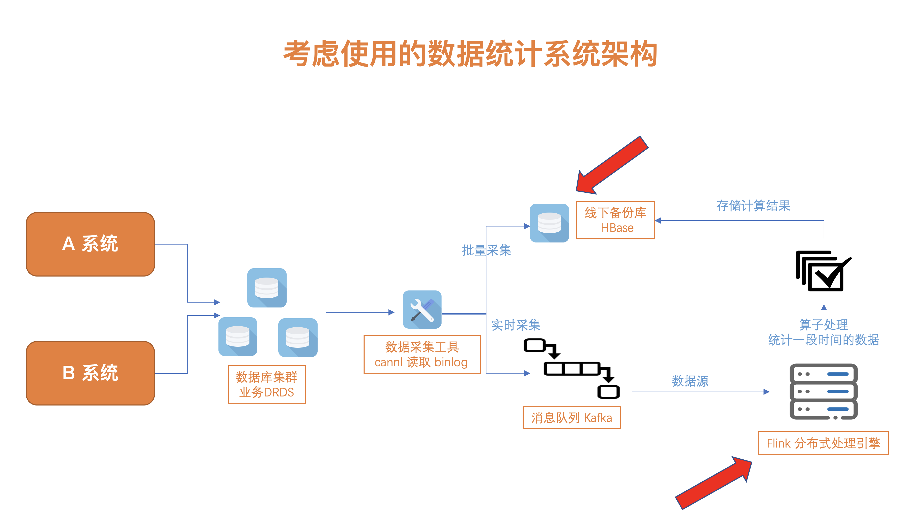
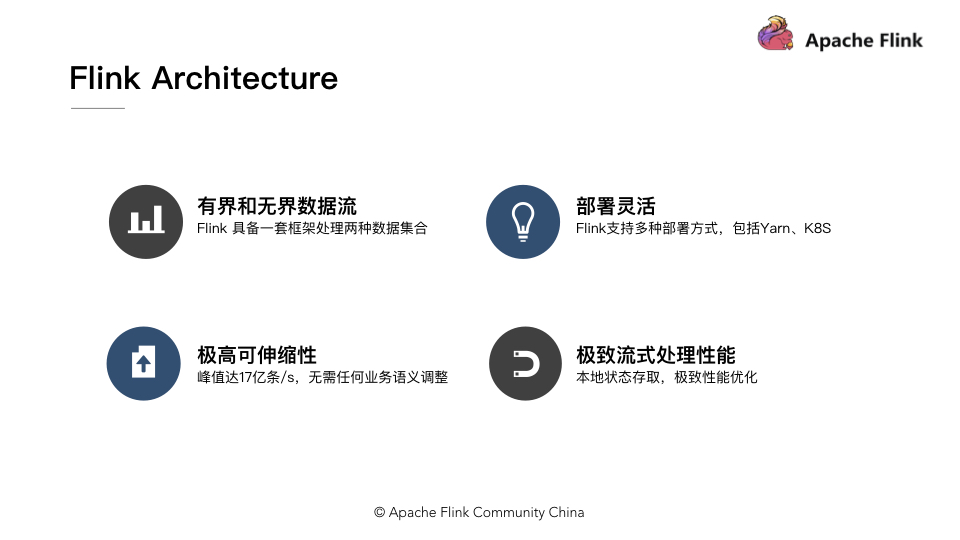
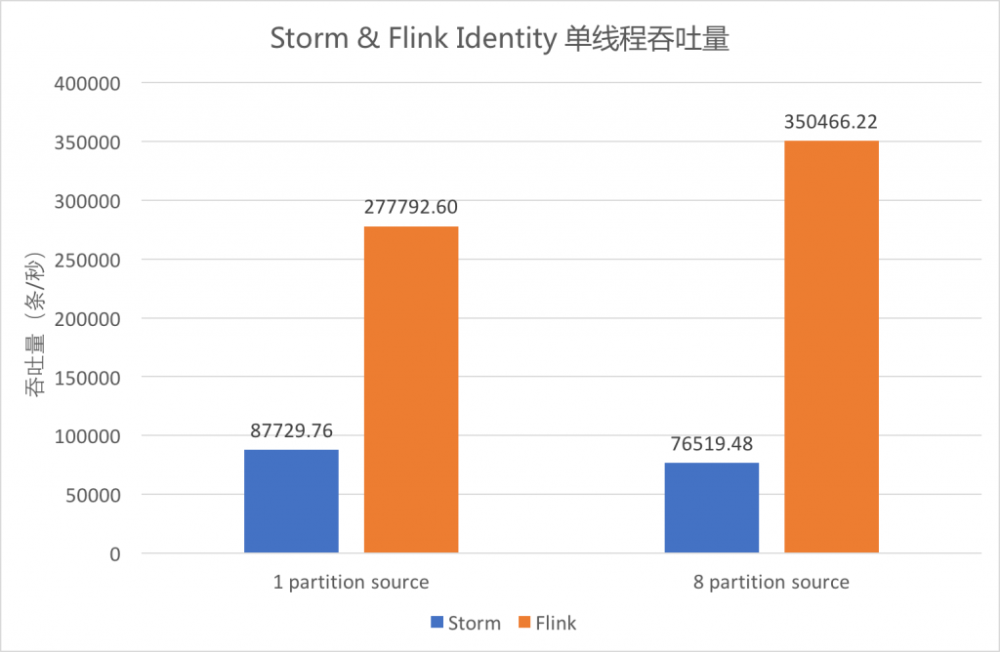
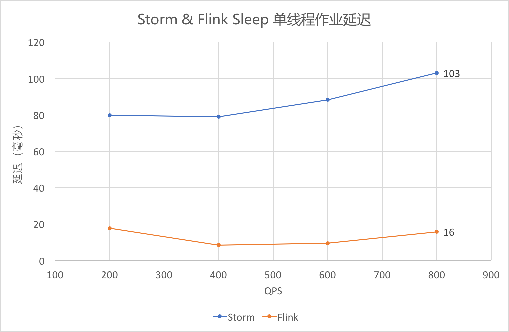
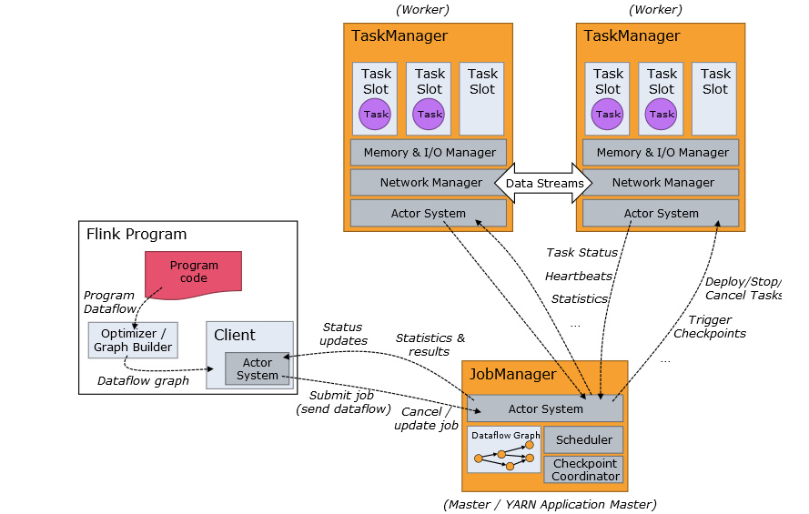
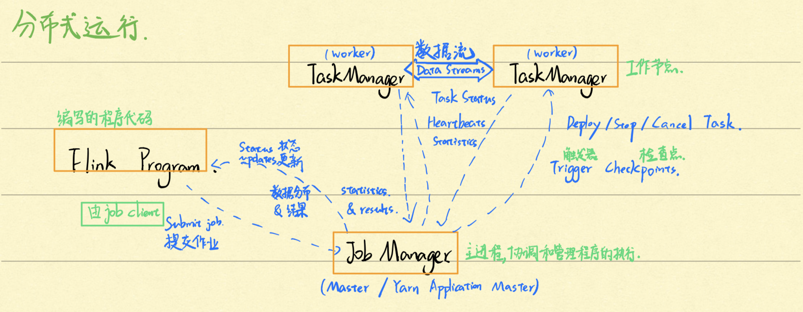
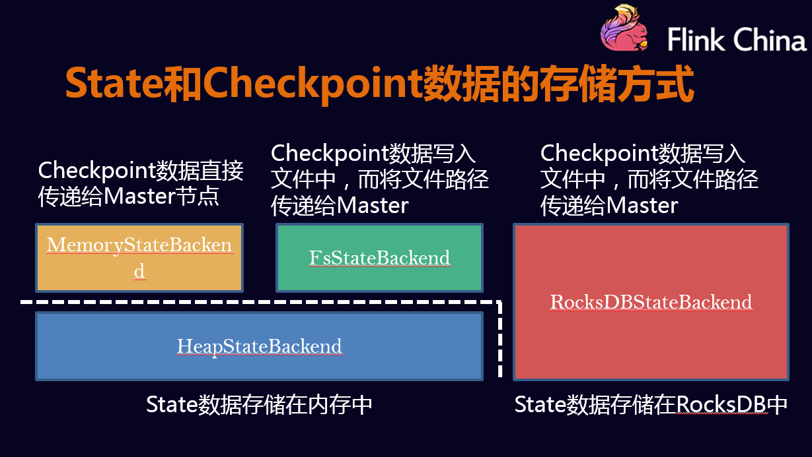
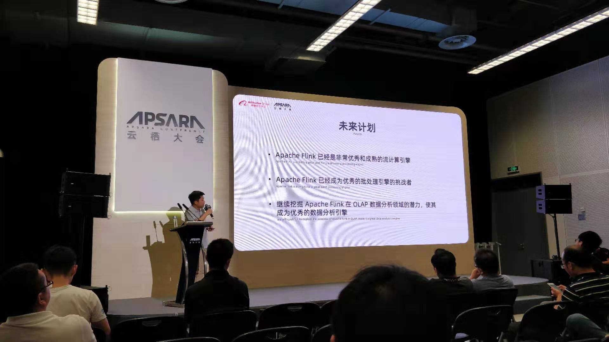

<!-- START doctoc generated TOC please keep comment here to allow auto update -->
<!-- DON'T EDIT THIS SECTION, INSTEAD RE-RUN doctoc TO UPDATE -->
**Table of Contents**  *generated with [DocToc](https://github.com/thlorenz/doctoc)*

- [为什么要学 Flink](#%E4%B8%BA%E4%BB%80%E4%B9%88%E8%A6%81%E5%AD%A6-flink)
- [官网介绍](#%E5%AE%98%E7%BD%91%E4%BB%8B%E7%BB%8D)
  - [基础语义](#%E5%9F%BA%E7%A1%80%E8%AF%AD%E4%B9%89)
    - [1、流 Stream](#1%E6%B5%81-stream)
    - [2、状态 State](#2%E7%8A%B6%E6%80%81-state)
    - [3、时间 Time](#3%E6%97%B6%E9%97%B4-time)
    - [4、接口 API](#4%E6%8E%A5%E5%8F%A3-api)
  - [架构介绍](#%E6%9E%B6%E6%9E%84%E4%BB%8B%E7%BB%8D)
    - [1、有界和无界数据流](#1%E6%9C%89%E7%95%8C%E5%92%8C%E6%97%A0%E7%95%8C%E6%95%B0%E6%8D%AE%E6%B5%81)
    - [2、部署灵活](#2%E9%83%A8%E7%BD%B2%E7%81%B5%E6%B4%BB)
    - [3、极高的可伸缩性](#3%E6%9E%81%E9%AB%98%E7%9A%84%E5%8F%AF%E4%BC%B8%E7%BC%A9%E6%80%A7)
    - [4、极致的流式处理性能](#4%E6%9E%81%E8%87%B4%E7%9A%84%E6%B5%81%E5%BC%8F%E5%A4%84%E7%90%86%E6%80%A7%E8%83%BD)
- [特性和优点](#%E7%89%B9%E6%80%A7%E5%92%8C%E4%BC%98%E7%82%B9)
  - [处理流程](#%E5%A4%84%E7%90%86%E6%B5%81%E7%A8%8B)
    - [1、数据源 Source](#1%E6%95%B0%E6%8D%AE%E6%BA%90-source)
    - [2、转换 Transaction](#2%E8%BD%AC%E6%8D%A2-transaction)
    - [3、存储 Sink](#3%E5%AD%98%E5%82%A8-sink)
  - [性能比较](#%E6%80%A7%E8%83%BD%E6%AF%94%E8%BE%83)
  - [管理方式 JobManager、TaskWorker](#%E7%AE%A1%E7%90%86%E6%96%B9%E5%BC%8F-jobmanagertaskworker)
  - [高可用 HA、状态恢复](#%E9%AB%98%E5%8F%AF%E7%94%A8-ha%E7%8A%B6%E6%80%81%E6%81%A2%E5%A4%8D)
  - [社区生态](#%E7%A4%BE%E5%8C%BA%E7%94%9F%E6%80%81)
  - [基础知识点](#%E5%9F%BA%E7%A1%80%E7%9F%A5%E8%AF%86%E7%82%B9)
- [总结：未来的计算方式](#%E6%80%BB%E7%BB%93%E6%9C%AA%E6%9D%A5%E7%9A%84%E8%AE%A1%E7%AE%97%E6%96%B9%E5%BC%8F)
- [参考资料](#%E5%8F%82%E8%80%83%E8%B5%84%E6%96%99)

<!-- END doctoc generated TOC please keep comment here to allow auto update -->

# 为什么要学 Flink

在 18 年时，就听说过 `Flink` 流式计算引擎，是阿里调研选型选择的新一代大数据框计算架，当时就记住了这个新框架。

由于工作中，常写的还是业务开发，没有系统的去学习它，恰好在今年，**我们的数据增长越来越快，架构师提出可以根据数据进行加工，通过数据分析得到更多指标性的计算结果，提供更多有价值的业务给用户。**

于是规划了基于以下的系统架构：

**可以看到，业务数据库与数据分析进行了剥离，避免了对核心业务的影响，基于数据分析的结果存储到线下备份库，查询大量的分析结果也不会影响核心业务。**

同时，在数据处理上，选择了 `Flink` 这个分布式处理引擎。随着深入的调研和了解，从它的描述、性能、接口编程和容错恢复上进行了学习，觉得它十分适合我们的场景，所以接下来我分享一下调研的结果~

<!--more-->

# 官网介绍

> [Apache Flink 是什么？](https://flink.apache.org/zh/flink-architecture.html)
> Apache Flink 是一个框架和分布式处理引擎，用于在无边界和有边界数据流上进行有状态的计算。Flink 能在所有常见集群环境中运行，并能以内存速度和任意规模进行计算。

官网也有中文版的文档，但是翻译的并不是很全面，经常跳转到英文博文，**这里推荐一个国内网站 [https://ververica.cn/](https://ververica.cn/)，上面的翻译和技术分享都十分的棒**，一开始就看英文文档还是比较吃力的，所以可以先从国内牛人的分享中学习起来~

---
## 基础语义

基础语义很重要，高层语法都是基础基础语义加工的，所以需要对它们有个了解，这里推荐的是 [`ververica`](https://ververica.cn/developers/flink-basic-tutorial-1-basic-concept/) 中的介绍：

### 1、流 Stream

从上图中看出，分为 **有界（bounded）** 和 **无界（unbounded）** 数据流。二者的区别在于无限数据流的数据会随着时间的推演而持续增加，计算持续进行且不存在结束的状态，相对的有限数据流大小固定，计算最终会完成并处于结束的状态。

同样还有 **实时** 和 **历史记录** 属性。流中的数据一生成就得到实时处理；另一种可能时效性要求不高，只需要在凌晨统计前一天完整的数据，可以先将数据流持久化到存储系统中，然后再进行批处理。

### 2、状态 State

状态时计算过程中的数据信息，在容错恢复和 `Checkpoint` 中有重要的作用，流计算在本质上是增量处理，因此需要不断查询保持状态；另外，为了保证 `Excatly-once` 语义，还需要将数据写入到状态中，用来保证在故障发生时，通过保存在状态中的数据，进行恢复，保证一致性；还有持久化存储，能够保证在整个分布式系统运行失败或者挂掉的情况下做到 `Exactly-once`，这是状态的另一个价值。

### 3、时间 Time

分为**事件时间（Event Time）**、**摄入时间（Ingestion Time）**、**处理时间（Processing Time）**，`Flink` 的无限数据流是一个持续的过程，时间是我们判断业务状态是否滞后，数据处理是否及时的重要依据。

`事件时间`：事件发生的时间，一般数据源携带的一个字段，指明事件发生的时间。

`处理时间`：事件被处理的时间，也就是由机器的系统时间决定。

`摄入时间`：时间进入 `Flink` 的时间，在数据源处，事件将会以当源的操作时间作为时间戳。

**三个时间出现的位置在上图的底部，具体的之后会专门讲述~**

### 4、接口 API

从上往下有三层，分别是 `SQL/Table API`、`DataStream API` 和 `ProcessFunction`，`API` 的表达能力及业务抽象能力都非常强大，但越接近 `SQL` 层，表达能力会逐步减弱，抽象能力会增强（由于是基础了解，所以没有对于 `SQL API` 层深入学习，感兴趣的同学可以深入了解）。

反之， `ProessFunction` 层 `API` 的表达能力非常强，可以进行多种灵活方便的操作，但抽象能力也相对越小。

**结合上面说的，平时用到最多的是中间 `DataStream` 这层的 `API`，后面的内容学习基本也是围绕着它~**

---
## 架构介绍

来源 [https://ververica.cn/developers/flink-basic-tutorial-1-basic-concept/](https://ververica.cn/developers/flink-basic-tutorial-1-basic-concept/)

###  1、有界和无界数据流

`Flink` 具有统一的框架处理有界和无界两种数据流的能力（流处理是无界的，批处理是有界的，给无界的流处理加上窗口 `Window` 就相当于有界的批处理，由于 `API` 是一致的，所以算子写完后可以进行复用）

### 2、部署灵活

`Flink` 底层支持多种资源调度器，包括 `Yarn`、`Kubernetes` 等。`Flink` 自身带的 `Standalone` 的调度器，在部署上也十分灵活。（`Standalone` 也是我们本地开发常用的模式）

---
### 3、极高的可伸缩性

可伸缩性对于分布式系统十分重要，资源不够可以动态添加节点，分摊压力，资源充足，撤下服务器，减少资源浪费。介绍中说到：阿里巴巴双 11 大屏采用 `Flink` 处理海量数据，使用过程中测得峰值可达 17 亿/秒。

### 4、极致的流式处理性能

`Flink` 相对于 `Storm` 最大的特地就是将状态语义完全抽象到框架后只能怪，支持本地状态读取，避免了大量网络 `IO`，可以极大提升状态存储的性能。

---
# 特性和优点

上面是对于 `Flink` 的定义以及架构上的介绍，下面来看下关于它更具体一点的信息，**在官网中，分为了【架构】、【应用】和【运维】三个方面来介绍**。

这里不会太深入分析，主要简单介绍它的特性和优点，有个大致的了解，由浅入深，在之后的文章中慢慢加深学习~

## 处理流程

`Flink` 程序的基本构建块是流和转换。 （请注意，`Flink` 的 `DataSet API `中使用的 `DataSet `也是内部流）从概念上讲，流是数据记录流（可能永无止境），而转换是将一个或多个流作为一个操作的操作。一个输入，可以产生一个（例如 `map`）或多个输出流（例如 `flatMap`）。

上图是数据处理流程，可以看到有几个核心组件：

### 1、数据源 Source
自带的 `api` 中，可以读取数据如下：集合数据（fromCollection）、文件数据（readFile）、网络套接字（socket）以及更多扩展来源（addSource），更多扩展中通过自定义来实现 `RichSourceFuncation`，实现读取更多来源的数据。

像图中获取的数据源是 `Kafka`，与其它中间件整合中，也封装了很多方便的方法，调用它们可以更方便获取数据源的数据。

### 2、转换 Transaction

进行数据的转化，对应于文档中的算子 `Operator`。常见的数据操作有以下：`map`、`flatMap`、`filter`、`keyBy`、`reduce`、`fold`（在 1.9 中看到被标注为 `deprecated`）、`aggregate`、`window`等常用操作。

同时从上图也能看出，转换的操作可以不止一次，多个算子可以形成 `chain` 链式调用，然后发挥作用。

### 3、存储 Sink

进行数据的存储或发送，对应于文档中的 `connector`（既可以连接数据源，也能发送到某个地方存储起来）。

常用的存储 `sink` 有 `Kafka`、`Apache Cassandra`、`Elasticsearch`、`RabbitMQ`、`Hadoop` 等。与前面一样，可以通过扩展 `RichSinkFunction` 进行自定义存储的逻辑。

## 性能比较

例如 `Hadoop`、`Storm` 或 `Spark`，与这些优秀的前辈们进行比较，对比性能的高低，如果选择使用 `Flink`，必须得比以前的开发方便和性能好。

由于之前没有使用过这些大数据框架，所以测评数据可以参考了这两篇：

- [Flink实时计算性能分析 https://ververica.cn/developers/shishijisuan/](https://ververica.cn/developers/shishijisuan/)
- [流计算框架 Flink 与 Storm 的性能对比 https://ververica.cn/developers/stream-computing-framework/](https://ververica.cn/developers/stream-computing-framework/)

下面简单列出它俩的**吞吐量和作业延迟的比较**

上图的数据源是 `Kafka Source`，蓝色是 `Storm`，橙色是 `Flink`，在一个分区 `partition` 情况下，`Flink` 吞吐约为 `Storm` 的 3.2 倍；而在 8 个分区情况下，性能提高到 4.6 倍。

上图采用的的 `outTime-eventTime` 作为延迟，可以看出，`Flink` 的延迟还是比 `Storm` 的要低。

## 管理方式 JobManager、TaskWorker

上面是官方示意图，阐述了 `Flink` 提交作业的流程，应用程序 `Flink Program`、`JobManage` 和 `TaskManager` 之间的关系。

上面是我对它的理解，个人觉得 `zhisheng` 大佬写的更加详细，可以参考这篇文章：[http://www.54tianzhisheng.cn/2018/10/13/flink-introduction/](http://www.54tianzhisheng.cn/2018/10/13/flink-introduction/)

## 高可用 HA、状态恢复

`High Availablity` 是个老生常谈的话题了，服务难免会遇到无法预测的意外，如何在出现异常情况下并尽快恢复，继续处理之前的数据，保证一致性，这是个考量服务稳定性的标准。

`Flink` 提供了丰富的状态访问（例如有 `List`、`Map`、`Aggregate` 等数据类型），以及高效的容错机制，存储状态 `State`，然后通过存储了状态的 `Checkpoint` 和 `Savepoint` 来帮助应用进行快速恢复。

详细请参考这两篇：

- [Apache Flink 零基础入门（七）：状态管理及容错机制 https://ververica.cn/developers/state-management/](https://ververica.cn/developers/state-management/)
- [Apache Flink状态管理和容错机制介绍 https://ververica.cn/developers/introduction-to-state-management-and-fault-tolerance/](https://ververica.cn/developers/introduction-to-state-management-and-fault-tolerance/) 

## 社区生态

**真的是十分敬仰发明优秀框架的团队，也十分敬佩每一个为技术做贡献的参与者，所以每次找到相关的资料都跟发现宝藏一样。**

下面罗列一下目前找到的资料：

- `Flink` 官网：[https://ci.apache.org/projects/flink/flink-docs-release-1.9/](https://ci.apache.org/projects/flink/flink-docs-release-1.9/)
- `Vererica` 国内牛人的分享：[https://ververica.cn](https://ververica.cn)
- `Github 项目` 可以关注一下提的问题和阿里分支 `Blink`：[https://github.com/apache/flink](https://github.com/apache/flink)
- `zhisheng` 个人学习的流程是跟着他的文章走了一遍，然后遇到不懂的继续深入学习和了解：[http://www.54tianzhisheng.cn/tags/Flink/](http://www.54tianzhisheng.cn/tags/Flink/)
- `wuchong` 这位大佬是从 16 年就开始研究 `Flink`，写的文章很有深度，想要详细了解 `Flink`，一定要看它的文章！：[http://wuchong.me/categories/Flink/](http://wuchong.me/categories/Flink/)

**从上面的资料可以看出，`Flink` 的社区慢慢从小众走向大众，越来越多人参与。**

---
## 基础知识点

运行环境如下：

> OS : Mac
>
> Flink Version : 1.9
>
> IDE : IDEA
>
> Java Version : 1.8

上图是我在学习过程中整理的一些知识点，之后将会根据罗列的知识点慢慢进行梳理和记录~

# 总结：未来的计算方式
从调研的结果中能看出，无论从性能、接口编程和容错上，`Flink` 都是一个不错的计算引擎。 `github` 拥有 1w 多个 `star`，这么多人支持以及阿里巴巴的大力推广，还有在 2019.09 参加的云栖大会，演讲嘉宾对 `Flink` 的展望

- **`Apache Flink` 已经是非常优秀和成熟的流计算引擎**
- **`Apache Flink` 已经成为优秀的批处理引擎的挑战者**
- **继续挖掘 `Apache Flink` 在 `OLAP` 数据分析领域的潜力，使其成为优秀的数据分析引擎**

直觉相信，`Flink` 的发展前景不错，希望接下来与大家分享和更好的去学习它~

---
# 参考资料

1. [Flink 从 0 到 1 学习 —— Apache Flink 介绍](http://www.54tianzhisheng.cn/2018/10/13/flink-introduction/)
2. [Apache Flink 是什么？](https://flink.apache.org/zh/flink-architecture.html)
3. [Apache Flink 零基础入门（一&二）：基础概念解析](https://ververica.cn/developers/flink-basic-tutorial-1-basic-concept/)
4. [为什么说流处理即未来？](https://ververica.cn/developers/stream-processing-is-the-future/)
5. [Apache Flink 零基础入门（七）：状态管理及容错机制](https://ververica.cn/developers/state-management/)
6. [Apache Flink状态管理和容错机制介绍](https://ververica.cn/developers/introduction-to-state-management-and-fault-tolerance/) 
