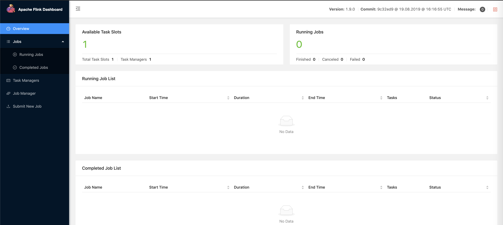
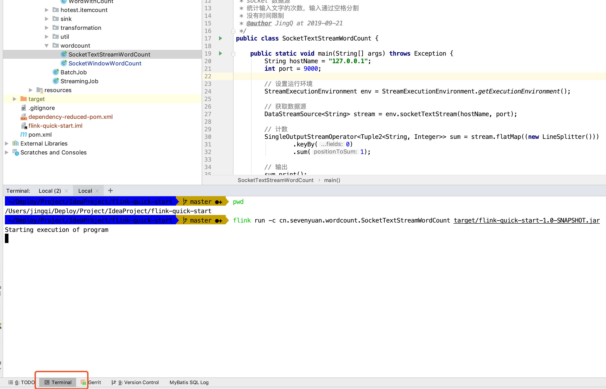
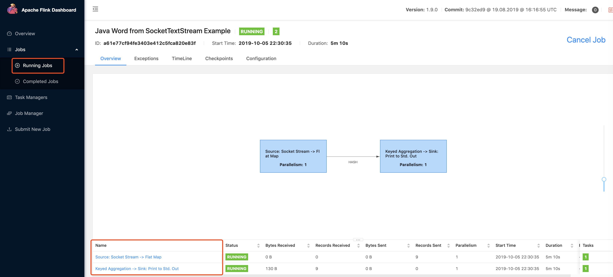

<!-- START doctoc generated TOC please keep comment here to allow auto update -->
<!-- DON'T EDIT THIS SECTION, INSTEAD RE-RUN doctoc TO UPDATE -->
**Table of Contents**  *generated with [DocToc](https://github.com/thlorenz/doctoc)*

- [1 环境准备](#1-%E7%8E%AF%E5%A2%83%E5%87%86%E5%A4%87)
  - [1.1 安装 Flink](#11-%E5%AE%89%E8%A3%85-flink)
  - [1.2 创建项目](#12-%E5%88%9B%E5%BB%BA%E9%A1%B9%E7%9B%AE)
- [2 开始项目](#2-%E5%BC%80%E5%A7%8B%E9%A1%B9%E7%9B%AE)
  - [2.1 项目代码](#21-%E9%A1%B9%E7%9B%AE%E4%BB%A3%E7%A0%81)
  - [2.2 开启 tcp 长链接](#22-%E5%BC%80%E5%90%AF-tcp-%E9%95%BF%E9%93%BE%E6%8E%A5)
  - [2.3 启动 Flink 程序](#23-%E5%90%AF%E5%8A%A8-flink-%E7%A8%8B%E5%BA%8F)
    - [2.3.1 本地调试](#231-%E6%9C%AC%E5%9C%B0%E8%B0%83%E8%AF%95)
    - [2.3.2 提交到 JobManager](#232-%E6%8F%90%E4%BA%A4%E5%88%B0-jobmanager)
  - [2.4 输入数据 & 验证结果](#24-%E8%BE%93%E5%85%A5%E6%95%B0%E6%8D%AE--%E9%AA%8C%E8%AF%81%E7%BB%93%E6%9E%9C)
- [3 扩展阅读](#3-%E6%89%A9%E5%B1%95%E9%98%85%E8%AF%BB)
- [4 总结](#4-%E6%80%BB%E7%BB%93)
- [5 项目地址](#5-%E9%A1%B9%E7%9B%AE%E5%9C%B0%E5%9D%80)
- [参考资料](#%E5%8F%82%E8%80%83%E8%B5%84%E6%96%99)

<!-- END doctoc generated TOC please keep comment here to allow auto update -->


在学习技术时，总会有一个简单程序 `Demo` 带着我们入门，所以参考着官网例子，带大家快速熟悉 `Flink` 的 `Hello World`~

说明一下，项目运行的环境如下：

> OS : Mac
>
> Flink Version : 1.9
>
> IDE : IDEA
>
> Java Version : 1.8

下面来讲下关于环境准备，如果是 `Windows` 的用户，请参照每个步骤，找到适应自己的安装 `or` 启动方法。

<!--more-->


# 1 环境准备

**首先我们默认已经安装了 `Jdk 1.8` 和编码工具 `IDEA`，下面来讲如何安装 `Flink` 和建立脚手架。下面展示的项目代码已经放入了 [Github](https://github.com/Vip-Augus/flink-learning-note)，可以下载进行本地运行**


## 1.1 安装 Flink

```sh
$ brew install apache-flink
```

检查安装是否成功以及版本号

```sh
$ flink --version
Version: 1.9.0, Commit ID: 9c32ed9
```

接着以单机集群模式启动 `Flink`

```sh
$ sh /usr/local/Cellar/apache-flink/1.9.0/libexec/bin/start-cluster.sh
Starting cluster.
Starting standalonesession daemon on host yejingqideMBP-c510.
Starting taskexecutor daemon on host yejingqideMBP-c510.
```

然后访问 `localhost:8081` 监控界面（1.9 版本更新了 UI）：




## 1.2 创建项目

这里推荐的是使用 `maven` 进行构建，在命令行中输入如下内容(# 号后面是说明，请不要输入）：

```sh
$ mvn archetype:generate \
    -DarchetypeGroupId=org.apache.flink \               # flink 的 group.id
    -DarchetypeArtifactId=flink-quickstart-java \       # flink 的 artifact.id
    -DarchetypeVersion=1.9.0 \                          # flink 的 version，以上三个请不要修改，按照默认即可
    -DgroupId=wiki-edits \                              # 项目的 group.id
    -DartifactId=wiki-edits \                           # 项目的 artifact.id
    -Dversion=0.1 \                                     # 项目的 version.id
    -Dpackage=wikiedits \                               # 项目的基础包名
    -DinteractiveMode=false                             # 是否需要和用户交互以获得输入，由于上面已经自己写了项目的参数，所以禁用了。反之请删掉 上面项目的配置，将交互模式设为 true
```

如果按照官方的例子填写，那么你将得到如下的项目结构：

```sh
$ tree wiki-edits
wiki-edits/
├── pom.xml
└── src
    └── main
        ├── java
        │   └── wikiedits
        │       ├── BatchJob.java
        │       └── StreamingJob.java
        └── resources
            └── log4j.properties
```

如果是自己自定义的，包结构会不一致，但是通过脚手架创立的，`pom` 文件中预置的依赖都将一致，引入了 `Flink` 基础开发相关的 `API`，然后通过 `IDEA` 打开该项目目录，就可以开始我们的 `Hello world`。


# 2 开始项目

首先交代一下待会的流程，编写程序代码，启动 `netcat` 命令来监听 9000 端口，启动或提交 `Flink` 程序，最后监听日志输出信息。


##  2.1 项目代码

`Demo` 的代码作用是监听 `netcat` 输入的字符，然后进行聚合操作，最后输出字符统计

```java
public class SocketTextStreamWordCount {

    public static void main(String[] args) throws Exception {
        String hostName = "127.0.0.1";
        int port = 9000;
        // 设置运行环境
        StreamExecutionEnvironment env = StreamExecutionEnvironment.getExecutionEnvironment();
        // 获取数据源
        DataStreamSource<String> stream = env.socketTextStream(hostName, port);
        // 计数
        SingleOutputStreamOperator<Tuple2<String, Integer>> sum = stream
            .flatMap((new LineSplitter()))
            .keyBy(0)
            .sum(1);
        // 输出
        sum.print();
        // 提交任务
        env.execute("Java Word from SocketTextStream Example");
    }

    public static final class LineSplitter implements FlatMapFunction<String, Tuple2<String, Integer>> {

        @Override
        public void flatMap(String s, Collector<Tuple2<String, Integer>> collector) throws Exception {
            String[] tokens = s.toLowerCase().split("\\W+");
            for (String token : tokens) {
                if (token.length() > 0) {
                    collector.collect(new Tuple2<String, Integer>(token, 1));
                }
            }
        }
    }
}
```


简单说明一下，上面出现了 `SocketTextStream` 套接字字符 **数据源（Source）**，接着是 **算子（Operator）**： `FlatMap`（一个输入源，可以输出零个或多个结果）、`KeyBy`（按照某字段或者 tuple 元组中某个下标进行分类） 和 `sum`（跟翻译一样，就是进行聚合汇总） ，最后输出


## 2.2 开启 tcp 长链接

为了模拟流数据，我们造的场景是不断往 9000 端口输入字符，`Flink` 程序添加的数据源是 `SocketTextStream` （套接字字符流）。

在你的终端中输入以下命令

```sh
$ nc -l 9000
```

有关 `netcat` 命令的用法，请看参考资料第二条，这里的作用就是打开 `TCP` 长链接，监听 9000 端口


## 2.3 启动 Flink 程序

刚才第一个步骤中，已经编辑好了程序代码，第二个步骤也已经启动了一个 `TCP` 客户端，启动 `Flink` 程序有两种方法：

### 2.3.1 本地调试

使用 `IDEA` 的好处很多，代码补全，语法检查和快捷键之类的。我经常使用的调试方法就是添加一个 `psvm` 的 `main` 方法，在里面写执行代码，最后点击绿色的启动按钮~


如果不需要调试，想直接看结果，选择第一个 `Run`，但有时不确定代码执行过程和出错的具体原因，可以通过第二个选项 `Debug` 进行调试。

这是本地开发经常使用的方法，进行结果的验证。


### 2.3.2 提交到 JobManager

前面我们启动的是单机集群版，启动了一个 `JobManager` 和 `TaskWorker`，打开的 `localhost:8081` 就是 `JobManager` 的监控面板，所以我们要通过下面的方式，将 `Flink` 程序提交到 `JobManager`。

这里教一个简单的方法，我们通过 `mvn clean package` 进行打包后，可以在 `IDEA` 集成的终端标签栏下提交我们的程序：



由于每个人的绝对路径都不一样，所以我们通过 `IDEA` 的终端，它会自动定位到项目的路径，然后执行时填写相对路径的 `jar` 包名字即可

```sh
$ flink run -c cn.sevenyuan.wordcount.SocketTextStreamWordCount target/flink-quick-start-1.0-SNAPSHOT.jar
```

`-c` 参数是指定运行的主程序入口，接着我们去查看监控面板，可以发现任务状态已经处于监控中：



顶部信息讲的是运行程序名字、时间、时间线、配置参数等信息，底下 `Name` 一栏，说明该程序逻辑步骤（读取数据源，进行映射处理，使用 keyBy 和聚合运算，最后输出到【打印 sink】）


## 2.4 输入数据 & 验证结果

前面验证了程序正常启动，接下来我们来验证输入和输出

先来监听输出，进入 `Flink` 的日志目录，接着通过 `tail` 命令监听任务执行者 `TaskWorkder`（默认会启动一个任务执行者，所以编码为 0） 的日志输出

```sh
$ usr/local/Cellar/apache-flink/1.9.0/libexec/log
$ tail -400f flink*-taskexecutor-0*.out

```

接着，在 `nc -l 9000` 对应的终端窗口中输入如下数据：

```sh
$ nc -l 9000
hello world
test world
test hello
hello my world
```

最后就能够看到以下输出结果：

```sh
(hello,1)
(world,1)
(test,1)
(world,2)
(test,2)
(hello,2)
(hello,3)
(my,1)
(world,3)
```

每行字符以空格进行分割，然后分别进行汇总统计，得到的输出结果一致。


# 3 扩展阅读

如果你在官网阅览，应该也曾看到过 `TimeWindow` 时间窗口的例子，下面是 `Demo` 代码

```java
public class SocketWindowWordCount {

    public static void main(String[] args) throws Exception {

        // the port to connect to
        String hostName = "127.0.0.1";
        int port = 9000;

        // get the execution environment
        final StreamExecutionEnvironment env = StreamExecutionEnvironment.getExecutionEnvironment();

        // get input data by connecting to the socket
        DataStream<String> text = env.socketTextStream("localhost", port, "\n");

        // parse the data, group it, window it, and aggregate the counts
        DataStream<WordWithCount> windowCounts = text
                .flatMap(new FlatMapFunction<String, WordWithCount>() {
                    @Override
                    public void flatMap(String value, Collector<WordWithCount> out) {
                        for (String word : value.split("\\s")) {
                            out.collect(new WordWithCount(word, 1L));
                        }
                    }
                })
                .keyBy("word")
                .timeWindow(Time.seconds(5), Time.seconds(1))
                .reduce(new ReduceFunction<WordWithCount>() {
                    @Override
                    public WordWithCount reduce(WordWithCount a, WordWithCount b) {
                        return new WordWithCount(a.getWord(), a.getCount() + b.getCount());
                    }
                });

        // print the results with a single thread, rather than in parallel
        windowCounts.print().setParallelism(1);

        env.execute("Socket Window WordCount");
    }
}
```

这里的程序代码核心点在于，**比之前的多了一个算子 `timeWindow`，并且有两个参数，分别是时间窗口大小以及滑动窗口大小（`Time size, Time slide`）**，下面是简单的输入和输出示意图：


由于滑动窗口大小是 1s，窗口是有重合的部分，然后每秒统计自己所在窗口的数据（5s 内传输过来的数据），可以看到第 6s 时，已经舍弃掉第 0s 输入的字符串数据。

小伙伴们也可以修改一下时间窗口大小和滑动窗口大小，然后输入自定义的数据，进行不同参数的设置，看下输出效果如何，是否有达到自己的预期。

这里先初步接触一下 **时间（Time）和窗口（Window）概念**，之后慢慢接触逐步加深理解吧。

---
# 4 总结

**本文基于 `Mac` 系统、 `Apache Flink 1.9` 版本进行了项目搭建和 `Demo` 编写，介绍了 `Suorce -> Transformation -> Sink` 的流程。简单的实现了一个字符计数器，往套接字数据源 `SocketTextStream`，源源不断的输入，然后进行统计出现的次数，如有疑惑或不对之处请与我讨论~**

---
# 5 项目地址

[https://github.com/Vip-Augus/flink-learning-note](https://github.com/Vip-Augus/flink-learning-note)

```sh
git clone https://github.com/Vip-Augus/flink-learning-note
```

---
# 参考资料

1. [DataStream API Tutorial](https://ci.apache.org/projects/flink/flink-docs-release-1.9/getting-started/tutorials/datastream_api.html)
2. [netcat 命令详解](https://segmentfault.com/a/1190000016626298)
3. [Flink 从 0 到 1 学习 —— Mac 上搭建 Flink 1.6.0 环境并构建运行简单程序入门](http://www.54tianzhisheng.cn/2018/09/18/flink-install/)