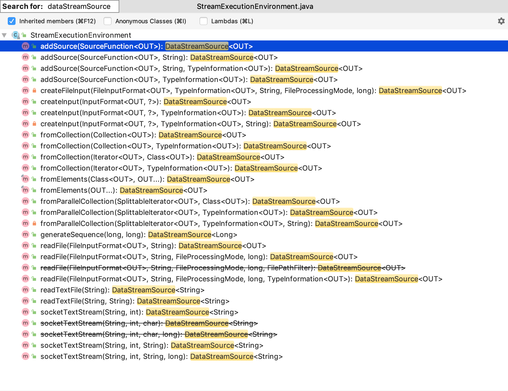
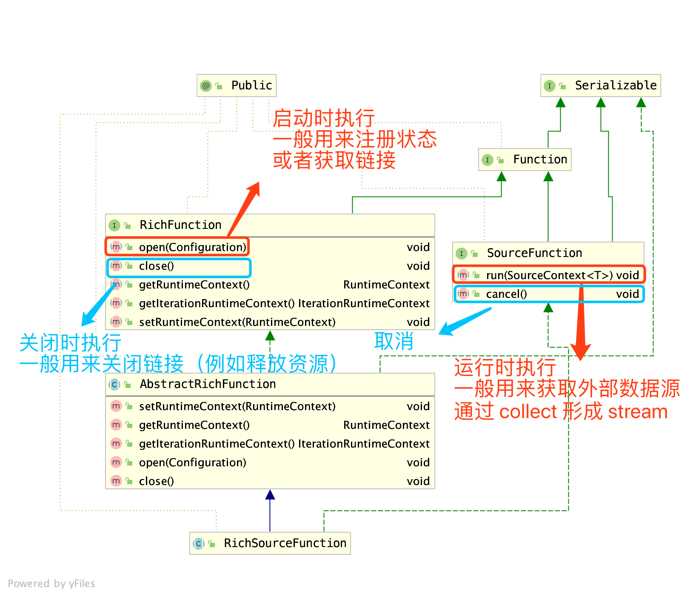
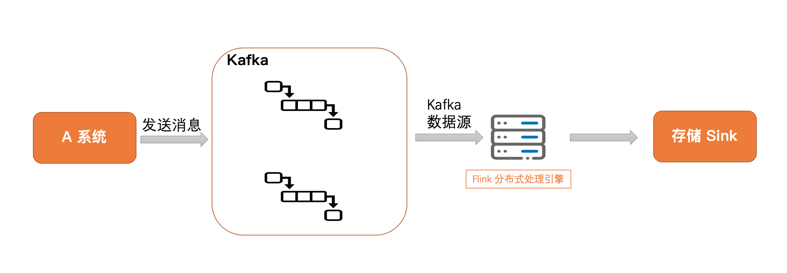
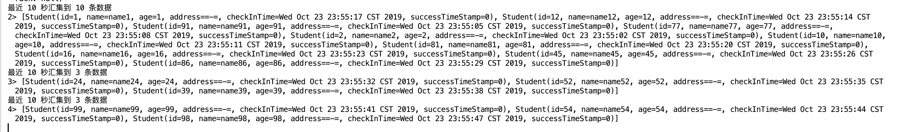
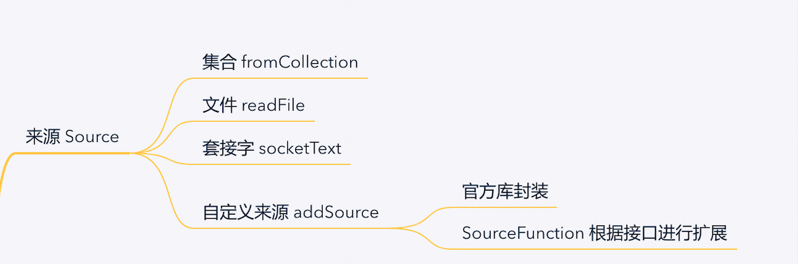

<!-- START doctoc generated TOC please keep comment here to allow auto update -->
<!-- DON'T EDIT THIS SECTION, INSTEAD RE-RUN doctoc TO UPDATE -->
**Table of Contents**  *generated with [DocToc](https://github.com/thlorenz/doctoc)*

- [为何要使用 Flink](#%E4%B8%BA%E4%BD%95%E8%A6%81%E4%BD%BF%E7%94%A8-flink)
- [1、前言](#1%E5%89%8D%E8%A8%80)
- [2、DataSource 介绍](#2datasource-%E4%BB%8B%E7%BB%8D)
- [3、集合](#3%E9%9B%86%E5%90%88)
- [4、文件 File](#4%E6%96%87%E4%BB%B6-file)
  - [4.1、实现 IMPLEMENTATION：](#41%E5%AE%9E%E7%8E%B0-implementation)
  - [4.2、重要笔记 IMPORTANT NOTES：](#42%E9%87%8D%E8%A6%81%E7%AC%94%E8%AE%B0-important-notes)
- [5、套接字 Socket](#5%E5%A5%97%E6%8E%A5%E5%AD%97-socket)
- [6、自定义 DataSource](#6%E8%87%AA%E5%AE%9A%E4%B9%89-datasource)
  - [6.1、RichSourceFunction](#61richsourcefunction)
  - [6.2、验证自定义数据源结果](#62%E9%AA%8C%E8%AF%81%E8%87%AA%E5%AE%9A%E4%B9%89%E6%95%B0%E6%8D%AE%E6%BA%90%E7%BB%93%E6%9E%9C)
- [7、更多自定义数据源（如 Kafka）](#7%E6%9B%B4%E5%A4%9A%E8%87%AA%E5%AE%9A%E4%B9%89%E6%95%B0%E6%8D%AE%E6%BA%90%E5%A6%82-kafka)
  - [7.1、测试场景示意](#71%E6%B5%8B%E8%AF%95%E5%9C%BA%E6%99%AF%E7%A4%BA%E6%84%8F)
  - [7.2、前置环境安装和启动](#72%E5%89%8D%E7%BD%AE%E7%8E%AF%E5%A2%83%E5%AE%89%E8%A3%85%E5%92%8C%E5%90%AF%E5%8A%A8)
  - [7.3、模拟应用系统](#73%E6%A8%A1%E6%8B%9F%E5%BA%94%E7%94%A8%E7%B3%BB%E7%BB%9F)
  - [7.4、启动 Flink 程序](#74%E5%90%AF%E5%8A%A8-flink-%E7%A8%8B%E5%BA%8F)
- [8、总结](#8%E6%80%BB%E7%BB%93)
- [项目地址](#%E9%A1%B9%E7%9B%AE%E5%9C%B0%E5%9D%80)
- [参考资料](#%E5%8F%82%E8%80%83%E8%B5%84%E6%96%99)

<!-- END doctoc generated TOC please keep comment here to allow auto update -->

# 为何要使用 Flink

因为本篇文章中，有个 `Kafka` 数据源的 `Demo`，在一开始解答小伙伴有可能的困惑：

**Question：既然监听 `Kafka` 消息，为何不建立一个简单的消息消费者，使用简单的代码就能进行消息的消费？**

**Answer：在普通的消费者逻辑中，只能做到对传送过来的一条消息进行单条处理。而在 `Flink` 这个优秀的流计算框架中，能够使用窗口进行多样化处理。提供了窗口处理函数，可以对一段时间（例如 5s 内）或者一批（计数大小，例如 5 个一批）的数据进行计数或者 `reduce` 整合处理**

**还有 `Flink` 拥有状态管理，能够保存 `checkpoint`，如果程序出现错误，也能够之前的检查点恢复，继续程序的处理，于是拥有这些好处的优秀框架，希望小伙伴也加入进来，一起学习~**

<!--more-->

# 1、前言

接下来的几篇文章，都会围绕着下面这张图，整体上来说，就是 `DataStreamAPI` 编程的练习：


**分别是 `Source`、`Transformation` 和 `Sink` 进行逐一学习。**

---
# 2、DataSource 介绍

直译：数据来源

计算引擎，不管是批出来还是流处理，最重要的是数据来源，根据源源不断的数据进行处理，加工成更有价值的数据。

**`Flink` 官方包中提供了如下基于集合、文件、套接字等 `API`，然后第三方例如 `Kafka`、`RabbitMq` 等也提供了方便的集成库。**


由于我们测试时，使用的是 `StreamExecutionEnvironment.getExecutionEnvironment()` 来获取流执行环境类进行操作，所以我们来看下这个类的返回类型是 `DataStreamSource` 的方法：



---
# 3、集合

集合数据源主要有三种：`collection`、`element` 和 `generateSequence`。

- **fromCollection(Collection)**：接受的参数对象必须是同一类型的集合
- **fromCollection(Iterator`<`OUT`>` data, Class`<`OUT`>` type)**：第一个参数是迭代器，第二个参数是指定返回的类型
- **fromElements(Class`<`OUT`>` type, OUT... data)**：第一个参数是指定返回的类型，后面的是不定数量入参，可以输入多个 `OUT` 类型的对象
- **fromParallelCollection(SplittableIterator`<`OUT`>` iterator, TypeInformation`<`OUT`>` typeInfo, String operatorName)**：**从一个可分离的迭代器中创建并行数据源**。这个方法是 `parallel` 并行数据源的底层调用方法，`typeInfo` 是具体的类型信息，最后一个参数就是操作名字。这个并行数据源并没有测试过，等到之后回来补坑吧。
- **generateSequence(long, long)**：创建一个包含数字序列的新数据流。例如传进去是 1l 和 10l，那么数据源就是 [1-10]

测试代码如下：

> DataSourceFromCollection.java

```java
private static DataStreamSource<Student> collection1(StreamExecutionEnvironment env) {
    List<Student> studentList = Lists.newArrayList(
            new Student(1, "name1", 23, "address1"),
            new Student(2, "name2", 23, "address2"),
            new Student(3, "name3", 23, "address3")
    );
    return env.fromCollection(studentList);
}


private static DataStreamSource<Long> collection2(StreamExecutionEnvironment env) {
    return env.generateSequence(1, 20);
}
```

---
# 4、文件 File

**从官方例子中，罗列了以下三个读取文件的方法，第一个返回的文本类型的数据源，第二个数据源是只读取一次文件，第三个方法参数比较多，文档中关于 `watchType` 观察类型介绍比较多，这里翻译自文档 [Flink DataStream API Programming Guide](https://ci.apache.org/projects/flink/flink-docs-release-1.9/dev/datastream_api.html)**

- **readTextFile(filePath)**：从 `filePath` 读取文本数据源，文本类型是 `TextInputFormat` 以及字符串类型是 `UTF-8`，返回的是文本类型的数据源
- **readFile(fileInputFormat, path)**： 根据指定的文件输入格式读取文件，只读取一次，不随着文本修改重新读取
- **readFile(fileInputFormat, path, watchType, interval, pathFilter, typeInfo)**：这是前两个内部调用的方法。它根据给定的 `fileInputFormat` 读取路径中的文件。 **根据提供的 `watchType` 对数据源做不同的操作，`FileProcessingMode.PROCESS_CONTINUOUSLY` 模式下，会定期（每间隔 ms）监视新数据的路径，`FileProcessingMode.PROCESS_ONCE` 模式下，会一次处理当前路径中的数据并退出。**使用 `pathFilter`，用户可以进一步从处理文件中排除文件。

---
## 4.1、实现 IMPLEMENTATION：

**在后台，Flink将文件读取过程分为两个子任务，即目录监视和数据读取。 这些子任务中的每一个都是由单独的实体实现的。**

监视由单个非并行（并行度= 1）任务实现，而读取由并行运行的多个任务执行。 

后者的并行性等于作业并行性。 单个监视任务的作用是扫描目录（根据 `watchType` 定期或仅扫描一次），查找要处理的文件，将它们划分为多个拆分，然后将这些拆分分配给下游读取器 （reader）。 

`readers` 是实际读取到数据的角色。每一个分片 `split` 只能由一个 `reader` 读取，但是一个 `reader` 可以读取多个分片 `split`。

---
## 4.2、重要笔记 IMPORTANT NOTES：

1. **如果 `watchType` 设置为 `FileProcessingMode.PROCESS_CONTINUOUSLY`，则在修改文件时，将完全重新处理其内容。** 这可能会破坏“完全一次”的语义，因为在文件末尾附加数据将导致重新处理其所有内容。 
2. **如果 `watchType` 设置为 `FileProcessingMode.PROCESS_ONCE`，则源将扫描路径一次并退出，而无需等待读取器完成文件内容的读取。** 当然，读者将继续阅读，直到读取了所有文件内容。 关闭源将导致在该点之后没有更多检查点。 这可能导致节点故障后恢复速度变慢，因为作业将从上一个检查点恢复读取。

根据上诉两种情况，个人觉得如果用文件数据作为数据源进行测试，那么使用第二种观察模式 `FileProcessingMode.PROCESS_ONCE`，只扫描一次，避免修改文件后影响之前的计算结果。

> DataSourceFromFile.java

```java

// 简单的文字文件输入流
DataStreamSource<String> textFileSource = env.readTextFile(filePath);

// 指定格式和监听类型
Path pa = new Path(filePath);
TextInputFormat inputFormat = new TextInputFormat(pa);
DataStreamSource<String> complexFileSource =
                env.readFile(inputFormat, filePath, 
                FileProcessingMode.PROCESS_CONTINUOUSLY, 
                100L, 
                TypeExtractor.getInputFormatTypes(inputFormat));
```

---
# 5、套接字 Socket

 - **socketTextStream**： 从套接字 `socket` 读取。 元素可以由自定义分隔符 `delimiter` 进行分隔。

> DataSourceFromSocket.java

```java
// 监听端口号
DataStreamSource<String> source = env.socketTextStream("localhost", 9000);

// 定义分隔符
DataStreamSource<String> source = env.socketTextStream("localhost", 9000, "\\W+");
```

更具体例子可以参考上一篇 `Hello World` 例子

---
# 6、自定义 DataSource

从前面介绍中看到，`Flink` 提供了一个 `addSource(SourceFunction<OUT>)` 的方法，其中 `SourceFunction` 是实现自定义数据源的关键接口，而我们常用来扩展的是它的抽象子类 `RichSourceFunction` 

---
## 6.1、RichSourceFunction

进行自定义扩展数据源前，来看下这个类的继承体系：



下面是我测试的一个场景：

1. 启动 `Redis`，手动不断设置某个 `key` 的值，模拟应用不断对它的修改
2. `Flink` 读取 `Redis` 数据源，进行数据加工
3. 存储加工后的数据（例如放入数据库或者简单打印出来）

于是乎，创建了一个自定义的 `Redis` 数据源，重写上面图中提到的方法

> MyRedisDataSourceFunction.java

```java
public class MyRedisDataSourceFunction extends RichSourceFunction<String> {

    @Override
    public void open(Configuration parameters) throws Exception {
        super.open(parameters);
        // noop
    }

    @Override
    public void run(SourceContext<String> ctx) throws Exception {
        while (true) {
            String maxNumber = RedisUtils.get("maxNumber", String.class);
            ctx.collect(StringUtils.isBlank(maxNumber) ? "0" : maxNumber);
            // 隔 1 s 执行程序
            Thread.sleep(1000);
        }
    }

    @Override
    public void cancel() {
        // noop
    }

    @Override
    public void close() throws Exception {
        super.close();
        RedisUtils.close();
    }
}
```

从上面代码可以看出，我在 `run` 方法中，通过 `while` 循环，不断从 `Redis` 中获取数据，关于缓存的相关操作，封装到了 `RedisUtils`，感兴趣的可以下载项目来看看。

由于偷懒，`open` 、`cancel` 是没有做操作，在关闭方法中，也只是简单释放了 `jedis` 连接。

---
## 6.2、验证自定义数据源结果

> DataSourceFromRedis.java

```java
public class DataSourceFromRedis {

    public static void main(String[] args) throws Exception {
        StreamExecutionEnvironment env =
            StreamExecutionEnvironment.getExecutionEnvironment();
        DataStreamSource<String> customSource = 
            env.addSource(new MyRedisDataSourceFunction());
        SingleOutputStreamOperator<String> operator = customSource
                .map((MapFunction<String, String>) value -> "当前最大值为 : " + value);
        operator.print();
        env.execute("test custom redis datasource function");
    }
}
```

上面代码，主要核心在于 `env.addSource(new MyRedisDataSourceFunction())`，从我们自定义的 `Redis` 数据源中获取数据，编写好代码后，进行打包并通过 `flink run` 执行。

为了方便，我直接在本地 `IDEA` 中，点击了绿色执行按钮，进行本地调试，接着来修改数据源和查看输出结果。

一、修改 `Redis` 中的数据
```sh
$ redis-cli -h localhost -p 6379
> set maxNumber 100
> set maxNumber 200
> set maxNumber 300
> set maxNumber 400
```

二、查看控制台输出结果

```sh
3> 当前最大值为 : 100
4> 当前最大值为 : 100
6> 当前最大值为 : 200
7> 当前最大值为 : 200
1> 当前最大值为 : 200
2> 当前最大值为 : 300
....
```

**可以看到数据源的修改，我们的程序能够正常接收到并进行处理**。当然这个 `Demo` 只是用来演示，用来演示我们可以基于变动的数据源进行更多复杂的操作，从而来达到数据处理想要的目的。

---
# 7、更多自定义数据源（如 Kafka）

例如在收集日志时，`Kafka` 消息中间件用得比较多，可以通过官方集成的方法 `new FlinkKafkaConsumer` 进行添加 `Kafka` 数据源


测试类位置在：

> cn.sevenyuan.datasource.custom.DataSourceFromKafka

```java
DataStreamSource<String> dataStreamSource = env.addSource(
    new FlinkKafkaConsumer<String>(
            KafkaUtils.TOPIC_STUDENT,
            new SimpleStringSchema(),
            props
    )).setParallelism(1);
```

## 7.1、测试场景示意



**测试场景如上图，模拟一个 `A` 应用系统，不断的往 `Kafka` 发送消息，接着我们的 `Flink` 监听到 `Kafka` 的数据变动，搜集在一个时间窗口内（例如 10s）的数据，对窗口内的数据进行转换操作，最后进行存储（简单演示，使用的是 `Print` 打印）**


## 7.2、前置环境安装和启动

如果在本地测试 `Kafka` 数据源，需要做这三步前置操作：

**1. 安装 `ZooKeeper`**，启动命令：
`zkServer start`

**2. 安装 `Kafka`**，启动命令：
`kafka-server-start /usr/local/etc/kafka/server.properties`

**3. 安装 `Flink`**，启动单机集群版的命令
`/usr/local/Cellar/apache-flink/1.9.0/libexec/bin/start-cluster.sh`

## 7.3、模拟应用系统

在终端中，通过 `Kafka` 命令创建名字为 `student` 的 `Topic`：

```sh
$kafka-topics --create --zookeeper localhost:2181 --replication-factor 1 --partitions 1 --topic student
```

启动以下代码的 `main` 方法，通过 `while` 循环，每隔 3s 往 `kafka`  发送一条消息：

> KafkaUtils.java

```java
public class KafkaUtils {

    public static final String BROKER_LIST = "localhost:9092";
    public static final String TOPIC_STUDENT = "student";
    public static final String KEY_SERIALIZER = "org.apache.kafka.common.serialization.StringSerializer";
    public static final String VALUE_SERIALIZER = "org.apache.kafka.common.serialization.StringSerializer";
    public static void writeToKafka() throws Exception {
        Properties props = new Properties();
        props.put("bootstrap.servers", BROKER_LIST);
        props.put("key.serializer", KEY_SERIALIZER);
        props.put("value.serializer", VALUE_SERIALIZER);
        KafkaProducer<String, String> producer = new KafkaProducer<>(props);
        // 制造传递的对象
        int randomInt = RandomUtils.nextInt(1, 100);
        Student stu = new Student(randomInt, "name" + randomInt, randomInt, "=-=");
        stu.setCheckInTime(new Date());
        // 发送数据
        ProducerRecord<String, String> record = new ProducerRecord<>(TOPIC_STUDENT, null, null, JSON.toJSONString(stu));
        producer.send(record);
        System.out.println("kafka 已发送消息 : " + JSON.toJSONString(stu));
        producer.flush();
    }
    public static void main(String[] args) throws Exception {
        while (true) {
            Thread.sleep(3000);
            writeToKafka();
        }
    }
}
```

在该工具类中，设定了很多静态变量，例如主题名字、`key` 序列化类、`value` 的序列化类，之后可以在其它类中进行复用。

点击 `main` 方法后，可以在控制台终端看到每隔三秒（`checkInTime` 间隔时间），我们的消息成功的发送出去了。

```sh
kafka 已发送消息 : {"address":"=-=","age":49,"checkInTime":1571845900050,"id":49,"name":"name49"}
kafka 已发送消息 : {"address":"=-=","age":92,"checkInTime":1571845903371,"id":92,"name":"name92"}
kafka 已发送消息 : {"address":"=-=","age":72,"checkInTime":1571845906391,"id":72,"name":"name72"}
kafka 已发送消息 : {"address":"=-=","age":19,"checkInTime":1571845909413,"id":19,"name":"name19"}
kafka 已发送消息 : {"address":"=-=","age":34,"checkInTime":1571845912435,"id":34,"name":"name34"}
```

## 7.4、启动 Flink 程序

> DataSourceFromKafka.java

```java
public static void main(String[] args) throws Exception {
    StreamExecutionEnvironment env = StreamExecutionEnvironment.getExecutionEnvironment();
    // 省略 kafka 的参数配置，具体请看代码
    Properties props = new Properties();
    DataStreamSource<String> dataStreamSource = env.addSource(new FlinkKafkaConsumer<String>(
            KafkaUtils.TOPIC_STUDENT,
            new SimpleStringSchema(),
            props
    )).setParallelism(1);

    // 数据转换 & 打印
    // 从 kafka 读数据，然后进行 map 映射转换
    DataStream<Student> dataStream = dataStreamSource.map(value -> JSONObject.parseObject(value, Student.class));
    // 不需要 keyBy 分类，所以使用 windowAll，每 10s 统计接收到的数据，批量插入到数据库中
    dataStream
            .timeWindowAll(Time.seconds(10))
            .apply(new AllWindowFunction<Student, List<Student>, TimeWindow>() {
                @Override
                public void apply(TimeWindow window, Iterable<Student> values, Collector<List<Student>> out) throws Exception {
                    List<Student> students = Lists.newArrayList(values);
                    if (students.size() > 0) {
                        System.out.println("最近 10 秒汇集到 " + students.size() + " 条数据");
                        out.collect(students);
                    }
                }
            })
            .print();
        env.execute("test custom kafka datasource");
    }
```

**上述代码主要有三个步骤，获取 `Kafka` 数据源 —> 数据转换（通过 `map` 映射操作，时间窗口搜集数据） —> 最后的数据存储（简单的 `print`）。**

点击执行代码后，我们就能在控制台中看到如下输出结果：



可以看到，按照发送消息的速度，我们能够在 10s 内搜集到 3-4 条数据，从输出结果能够验证 `Flink` 程序的正确性。

安装操作请参考网上资源，更多详细添加 `Kafka` 数据源的操作可以看**项目中的测试类 `DataSourceFromKafka`和 `zhisheng` 写的 [Flink 从 0 到 1 学习 —— 如何自定义 Data Source ](http://www.54tianzhisheng.cn/2018/10/30/flink-create-source/)**


---
# 8、总结


本章总结大致可以用下面这张思维导图概括：



- 集合、文件：读取本地数据，比较适合在本地测试时使用
- 套接字：监听主机地址和端口号，获取数据，比较少用
- 自定义数据源：一般常用的数据源，例如 `Kafka`、`Hive` 和 `RabbitMQ`，官方都有集成的依赖，通过 `POM` 进行引用即可使用，还有想要自己扩展的话，通过继承 `RichSourceFunction`，重写里面的方法，就能够获取自定义的数据

**本文主要写了 `Flink` 提供的数据源使用，介绍了集合、文件、套接字和自定义数据源的例子。当然请根据自己的用途，选择使用合适的数据源，如有疑惑或不对之处请与我讨论~**

---
# 项目地址

[https://github.com/Vip-Augus/flink-learning-note](https://github.com/Vip-Augus/flink-learning-note)

```sh
git clone https://github.com/Vip-Augus/flink-learning-note
```

---
# 参考资料

1. [Flink 从 0 到 1 学习 —— Data Source 介绍](http://www.54tianzhisheng.cn/2018/10/28/flink-sources/)
2. [流式连接器](https://ci.apache.org/projects/flink/flink-docs-release-1.9/zh/dev/connectors/)
3. [Flink DataStream API Programming Guide](https://ci.apache.org/projects/flink/flink-docs-release-1.9/dev/datastream_api.html)
4. [Flink 从 0 到 1 学习 —— 如何自定义 Data Source ](http://www.54tianzhisheng.cn/2018/10/30/flink-create-source/)
5. [Flink实践-读取kafka](https://chloy.com/2017/06/09/Flink%E5%AE%9E%E8%B7%B5-%E8%AF%BB%E5%8F%96kafka/)