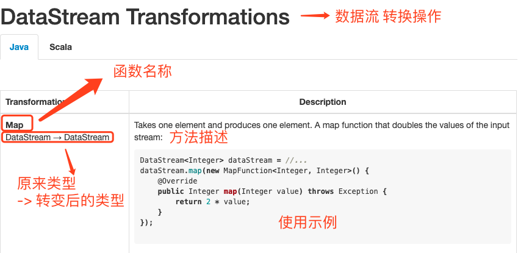
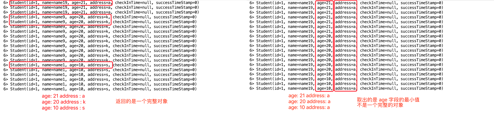
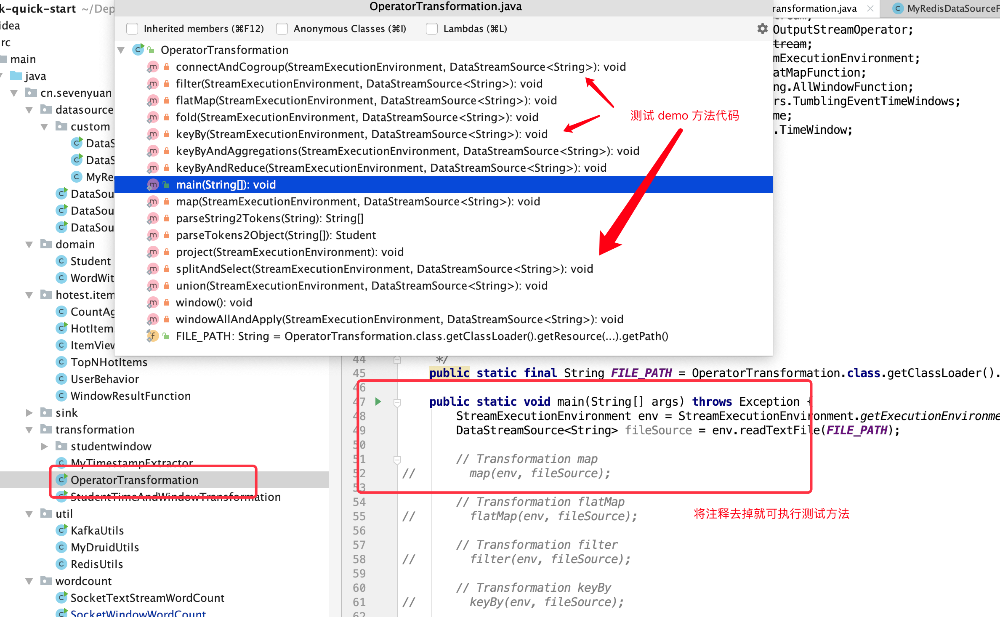

<!-- START doctoc generated TOC please keep comment here to allow auto update -->
<!-- DON'T EDIT THIS SECTION, INSTEAD RE-RUN doctoc TO UPDATE -->
**Table of Contents**  *generated with [DocToc](https://github.com/thlorenz/doctoc)*

- [前言](#%E5%89%8D%E8%A8%80)
- [转换 Transformation](#%E8%BD%AC%E6%8D%A2-transformation)
  - [一、Map，DataStream ---> DataStream](#%E4%B8%80mapdatastream-----datastream)
  - [二、FlatMap，DataStream ---> DataStream](#%E4%BA%8Cflatmapdatastream-----datastream)
  - [三、Filter，DataStream ---> DataStream](#%E4%B8%89filterdatastream-----datastream)
  - [四、KeyBy，DataStream ---> KeyedStream](#%E5%9B%9Bkeybydatastream-----keyedstream)
  - [五、 Reduce，KeyedStream ---> DataStream](#%E4%BA%94-reducekeyedstream-----datastream)
  - [六、Fold，KeyedStream ---> DataStream](#%E5%85%ADfoldkeyedstream-----datastream)
  - [七、Aggregations，KeyedStream ---> DataStream](#%E4%B8%83aggregationskeyedstream-----datastream)
    - [1. 测试文件](#1-%E6%B5%8B%E8%AF%95%E6%96%87%E4%BB%B6)
    - [2. 测试代码](#2-%E6%B5%8B%E8%AF%95%E4%BB%A3%E7%A0%81)
    - [3. 查看结果](#3-%E6%9F%A5%E7%9C%8B%E7%BB%93%E6%9E%9C)
  - [八、Window，KeyedStream ---> WindowedStream](#%E5%85%ABwindowkeyedstream-----windowedstream)
  - [九、WindowAll，DataStream ---> AllWindowedStream](#%E4%B9%9Dwindowalldatastream-----allwindowedstream)
  - [十、Window Reduce、Apply、Aggregations，WindowedStream ---> DataStream](#%E5%8D%81window-reduceapplyaggregationswindowedstream-----datastream)
  - [十一、Union，DataStream * ---> DataStream](#%E5%8D%81%E4%B8%80uniondatastream------datastream)
  - [十二、Window Join， DataStream,DataStream ---> DataStream](#%E5%8D%81%E4%BA%8Cwindow-join-datastreamdatastream-----datastream)
  - [十三、Window coGroup，DataStream,DataStream ---> DataStream](#%E5%8D%81%E4%B8%89window-cogroupdatastreamdatastream-----datastream)
  - [十四、Connect，DataStream,DataStream ---> ConnectedStreams](#%E5%8D%81%E5%9B%9Bconnectdatastreamdatastream-----connectedstreams)
  - [十五、Split，DataStream ---> SplitStream](#%E5%8D%81%E4%BA%94splitdatastream-----splitstream)
  - [十六、Select，SplitStream ---> DataStream](#%E5%8D%81%E5%85%ADselectsplitstream-----datastream)
  - [十七、Project，DataStream ---> DataStream](#%E5%8D%81%E4%B8%83projectdatastream-----datastream)
- [总结](#%E6%80%BB%E7%BB%93)
- [项目地址](#%E9%A1%B9%E7%9B%AE%E5%9C%B0%E5%9D%80)
- [参考资料](#%E5%8F%82%E8%80%83%E8%B5%84%E6%96%99)

<!-- END doctoc generated TOC please keep comment here to allow auto update -->


# 前言

前面写了如何使用 `Flink` 读取常用的数据源，也简单介绍了如何进行自定义扩展数据源，本篇介绍它的下一步：数据转换 `Transformation`，其中数据处理用到的函数，叫做算子 `Operator`，下面是算子的官方介绍。

> 算子将一个或多个 `DataStream` 转换为新的 `DataStream`。程序可以将多种转换组合成复杂的数据流拓扑。

<!--more-->

在学习过程中，官网是个不错的入门介绍，格式如下：



一共有两列，左边介绍了函数名称，转换前的流类型，以及转换后的流类型，右边进行了方法描述，介绍该算子的概念和作用，然后有个代码段，告诉了如何使用它。

但官网的中文介绍不多，有些例子 `demo` 也有点不完善，所以接下来我会将自己理解笔记贴下来，跟大家一起来学习。

友情提示，贴出来的代码段可能不完整，可以下载 [github](https://github.com/Vip-Augus/flink-learning-note) 上的代码进行参考。

# 转换 Transformation

## 一、Map，DataStream ---> DataStream

**映射转换**。输入是一个 `DataStream`，输出也是一个 `DataStream`，属于一对一操作，例如输入是 [1, 3, 5]，然后每个数乘以 2，可以通过下面形式实现：

```java
dataStream.map((MapFuction) <Integer, Integer>) value -> value * 2;); 
```

将会输出 [2, 6, 10]，也有可能不是如上顺序，默认按照程序处理数据的时间进行输出。

**后面如果大家发现执行顺序与我展示的不一致，请不用担心，属于正常现象，由于顺序性问题涉及到时间和窗口属性的作用，所以请各位先按照默认情况运行，理解算子的概念和使用，之后再去了解上诉概念。**

## 二、FlatMap，DataStream ---> DataStream

**"平坦"映射（不知道该如何翻译囧）。**不同于上面的单个操作，这是一对多操作，取一个元素并产生零个，一个或多个元素。例如拆分一行字符串，然后输出多个单词：

```java
SingleOutputStreamOperator<String> operator = source.flatMap(new FlatMapFunction<String, String>() {
    @Override
    public void flatMap(String value, Collector<String> out) throws Exception {
        String[] tokens = parseString2Tokens(value);
        if (tokens == null) {
            return;
        }
        for (String token : tokens) {
            out.collect(token);
        }
    }
});
```

输出多个元素的关键是 `Collector` 这个参数，通过它可以收集到更多元素。

## 三、Filter，DataStream ---> DataStream

**过滤操作**。通过一个 `boolean function` 对元素进行过滤，保留为 `true` 的元素，从而达到过滤的目的。例如下面过滤操作，保留 `id` 是偶数的元素：

```java
SingleOutputStreamOperator operator = source.filter((FilterFunction<String>) value -> {
    Student stu = parseTokens2Object(parseString2Tokens(value));
    return stu != null && stu.getId() % 2 == 0;
});
```

## 四、KeyBy，DataStream ---> KeyedStream

**按键 `key` 进行分类**。`KeyBy` 通过 `Hash partitioning` 方法将一个 `stream` 变成一组不想交的分区 `partitions`，每个 `partitions` 包含的元素具有相同的 `key`。例如输入的是一组字符串，根据第一个字段的整数值进行分类：

```java
KeyedStream<String, Integer> keyedStream = source.keyBy((KeySelector<String, Integer>) value -> {
    String[] tokens = parseString2Tokens(value);
    return tokens == null ? 0 : Integer.valueOf(tokens[0]);
});
```

**注意，`KeyBy` 操作后，流类型从 `DataStream` 变成了 `keyedStream`，是一组 `partitions`。**

上面介绍的是通用类型的 `keySelector` 分类方法，也可以通过下述两种方法进行分区：

```java
keyedStream.keyBy(0); // key 是 tuple 中的第一个元素
keyedStream.keyBy("id"); //  key 是 pojo 中的 id 字段，实现了 getter、setter
```

## 五、 Reduce，KeyedStream ---> DataStream

**对按 `key` 分类的数据流进行"滚动"压缩**。可以将当前元素与前一个元素进行整合处理，并返回一个新值。

例如下面例子，通过 `id` 字段进行分类，然后使用 `reduce` 进行压缩处理，每次将学生的名字字段进行拼接，年龄进行相加，返回一个新的对象：

```java
SingleOutputStreamOperator operator = source
    .map((MapFunction<String, Student>) value -> parseTokens2Object(parseString2Tokens(value)))
    .keyBy((KeySelector<Student, Integer>) value ->  value == null ? 0 : value.getId())
    .reduce((ReduceFunction<Student>) (value1, value2) -> {
        Student student = new Student();
        student.setId(value1.getId() + value2.getId());
        student.setName(value1.getName() + " || " + value2.getName());
        student.setAge(value1.getAge() + value2.getAge());
        return student;
    });
```

输出结果如下：

```sh
16> Student(id=2, name=name2, age=22)
11> Student(id=1, name=name1, age=21)
15> Student(id=3, name=name13, age=28)
16> Student(id=5, name=name10, age=25)
16> Student(id=10, name=name10 || name15, age=55)
16> Student(id=4, name=name2 || name7, age=44)
16> Student(id=6, name=name2 || name7 || name12, age=71)
...
16> Student(id=15, name=name10 || name15 || name5, age=80)
1> Student(id=12, name=name4 || name9 || name14, age=77)
11> Student(id=3, name=name1 || name6 || name11, age=68)
```

从结果可以看到，`id` 相同的都分到同一个分区（测试中可以简单通过前面的线程 `id` 确认，属于同一分区处理），然后传入新对象，按照 `reduce` 的操作进行了处理，返回了拼装之后的对象。

## 六、Fold，KeyedStream ---> DataStream

**滚动折叠**。合并当前元素和上一个被折叠的值，输入值可以与返回值类型不一样。

例如数据流是一组数字 [1, 5, 7]，想要输出一个拼接后的字符串，可以通过下面进行处理：

```java
// 标准格式
keyedStream.fold(${initialValue}, (s1, s2) -> s1 + " || " + s2);

SingleOutputStreamOperator operator = source
    .map((MapFunction<String, Student>) value -> parseTokens2Object(parseString2Tokens(value)))
    .keyBy("id")
    .fold("strat", new FoldFunction<Student, String>() {
        @Override
        public String fold(String accumulator, Student value) throws Exception {
            return accumulator + " || " + value;
        }
    });
```

上述例子的 `${initialValue}` 初始值是 `start`，然后在方法中通过 ` || ` 分隔符进行拼接，最后输出结果是：

```sh
16> strat || Student(id=2, name=name2, age=22)
11> strat || Student(id=1, name=name1, age=21)
15> strat || Student(id=3, name=name13, age=28)
16> strat || Student(id=2, name=name2, age=22) || Student(id=2, name=name12, age=27)
1> strat || Student(id=4, name=name9, age=24)
11> strat || Student(id=1, name=name1, age=21) || Student(id=1, name=name6, age=21)
1> strat || Student(id=4, name=name9, age=24) || Student(id=4, name=name14, age=29)
16> strat || Student(id=2, name=name2, age=22) || Student(id=2, name=name12, age=27) || Student(id=2, name=name7, age=22)
...
```

从输出结果可以看到，初始值和每次处理的对象进行了拼接，最后返回的是折叠后的对象，不过该方法被标注为 `@Deprecated`，不建议继续使用。

## 七、Aggregations，KeyedStream ---> DataStream

**在按 `key` 分类的数据流上滚动聚合。**要注意的是  `min` 和 `minBy` 之间的区别是 `min` 返回**指定字段**的最小值，而 `minBy` 返回在此字段中具有最小值的**元素，也可以理解成整个对象**（`max` 和 `maxBy` 的机制相同）

常用的 `sum` 合计函数就不多说了，下面具体展示的 `min` 和 `minBy` 函数，取当前流中的最小值：

测试代码的逻辑是：从一个文本流中读取数据，转换成对象，接着根据 `id` 进行 `keyBy` 分类，接着从每组分区 `partitions` 中取出年龄 `age` 字段最小的，**我们来分别测试 `min` 和 `minBy` 的不同之处**：

### 1. 测试文件

```sh
# id, name, age, address (代替 index 下标)
...
1 name10 21 j
1 name9 20 k
1 name8 21 l
1 name7 21 m
...
1 name2 21 r
1 name1 10 s
```

为了便于从小样本中观察的具体的区别，`id` 字段都设成 1，它们将会分组到同一个 `partitions`，然后 `age` 字段有三种值（21、20 和 10），每次处理一个元素时，都会输出一个最小值

### 2. 测试代码

```java
SingleOutputStreamOperator operator = source
    .map((MapFunction<String, Student>) value -> {
         parseTokens2Object(parseString2Tokens(value)); }
    )
    .keyBy("id")
    // 这里表示选择使用 minBy 或者 min 函数
    .minBy("age")/min("age");
```

### 3. 查看结果



左图是 `minBy`，右图是 `min` 输出结果，从结果可以看出，`minBy` 返回多个值的意思是：**返回元素的完整对象**，而 `min` 返回的是字段的最小值，其它字段将不会修改。于是左边能看到不同的 `age` 对应的下标 `address` 是不同的，而右边不同的 `age`，对应的还是第一次输出的 `address` 结果。

**综上所述，如果使用聚合函数 `minBy` 和 `min`（以及 `max`），注意自己需要返回的类型，是否需要一个完整的对象，如果是的话，请选择使用 `minBy`。**

## 八、Window，KeyedStream ---> WindowedStream

**窗口**。该函数允许在**已分区**的 `KeyedStream` 上定义窗口。例如最近 5 秒内到达的数据：

```java
dataStream.keyBy(0).window(TumblingEventTimeWindows.of(Time.seconds(5)));
```

## 九、WindowAll，DataStream ---> AllWindowedStream

**在 `DataStream` 上定义窗口**。与上面不同的是，此次定义的范围是**所有流**，`windows` 会根据某些特征（例如，最近 5 秒内到达的数据）对所有流事件进行划分窗口。

```java
SingleOutputStreamOperator<Student> operator = source
                .map((MapFunction<String, Student>) value -> parseTokens2Object(parseString2Tokens(value)))
                .assignTimestampsAndWatermarks(new MyTimestampExtractor())
                .windowAll(TumblingEventTimeWindows.of(Time.milliseconds(1)))
                .apply(new AllWindowFunction<Student, Student, TimeWindow>(){...};
```

注意：在许多情况下，这是非并行转换，所有记录都将被收集在 `WindowAll` 运算符的一项任务中。

## 十、Window Reduce、Apply、Aggregations，WindowedStream ---> DataStream

窗口函数跟前面提到的常用函数一样，也有**属于窗口的数据流功能**。

例如应用 `apply` 进行自定义逻辑加工，还有 `reduce` 进行“压缩”，返回合并后的值、`sum` 等统计函数。

**唯一不同的是，前面常规函数对应的整个流中的数据，而 `window` 针对是根据特征（例如 5s 时间内）分开的窗口流的数据进行操作。**

```java
windowedStream.apply(new WindowFunction<...>{...});
windowedStream.sum(0;
windowedStream.min("key");
windowedStream.maxBy(0);
```

## 十一、Union，DataStream * ---> DataStream

**联合**。Union 将两个或多个数据流合并，生成一个新的数据流，包含了本身以及参数中数据流的所有数据。

```java
dataStream.union(otherStream1, otherStream2);
```

如果是一个数据流联合它自己，相当于得到两份同样的数据。

## 十二、Window Join， DataStream,DataStream ---> DataStream

**窗口连接**。通过 **`key`** 将同一个 `window` 的两个数据流 `join` 起来。

```java
dataStream.join(otherStram)
    .where(<KeySelector>)
    .equalsTo(<KeySelector>)
    .window(TumblingEventTimeWindows.of(Time.seconds(3)))
    .apply(new JoinFunction<...>{...});
```

上面代码的作用是，在 3s 时间内连接两个窗口，连接条件是 `where` （第一个流）和 `equalsTo` （第二个流）相同的返回值。

## 十三、Window coGroup，DataStream,DataStream ---> DataStream

**窗口连接**。跟上面的作用一样，通过 **`key`** 将同一个 `window` 的两个数据流连接起来。

```java
dataStream.coGroup(otherStram)
    .where(<KeySelector>)
    .equalsTo(<KeySelector>)
    .window(TumblingEventTimeWindows.of(Time.seconds(3)))
    .apply(new CoGroupFunction<...>{...});
```

可以看到，除了 `join` 和 `coGroup` 函数不同外，还有一个 `apply` 处理使用的参数类型也不一样。

```java
interface JoinFunction<IN1, IN2, OUT> {
    OUT join(IN1 first, IN2 second);
}

interface CoGroupFunction<IN1, IN2, O> {
    void coGroup(Iterable<IN1> first, Iterable<IN2> second, Collector<O> out);
}
```

上面展示的是两个接口，在 `join` 算子中使用的是 `JoinFunction`，对应的 `join` 方法是两个窗口流的单个入参；在 `coGroup` 算子中，使用的是 `CoGroupFunction`，对应的 `coGroup` 方法是两个窗口流的迭代器，可以进行更多数据处理。

在参考资料四种详细介绍了两个的区别，如有连接操作，为了更多扩展性，推荐使用的是 `CoGroup` 算子。

## 十四、Connect，DataStream,DataStream ---> ConnectedStreams

**数据流连接**。“连接”两个保存其类型的数据流，该连接允许两个流之间的共享状态。

例如下面连接了两个数据流，将会转换成 `ConnectedStram` 类型，接着使用 `CoFlatMapFunction` 分别对合并流中两种类型数据流进行处理（也可以自定义一个 `MyCoFlatMapFunction` 类，继承自 `RichCoFlatMapFunction`），在里面实现自己的逻辑

```java
ConnectedStreams<String, Student> connectedStreams = source.connect(studentDataStreamSource);
connectedStreams.flatMap(new CoFlatMapFunction<String, Student, Object>() {
    @Override
    public void flatMap1(String value, Collector<Object> out) throws Exception {
        // 状态 1
        out.collect("Add prefix : " + value);
    }
    @Override
    public void flatMap2(Student value, Collector<Object> out) throws Exception {
        // 状态 2
        if (value.getId() % 2 != 0) {
            out.collect(value);
        }
    }
});
```

前面的连接 `Join`/`CoGroup` 数据流类型都必须是一致，而使用 `Connecte` 算子，允许两个数据流的类型不同，根据 `flatMap1`（处理的是字符串） 和 `flatMap2` （处理的是对象）中的 `collecot` 收集，进行输出：

```sh
7> Add prefix : 1 name1 21 a
7> Add prefix : 2 name2 22 b
6> Add prefix : 5 name15 30 o
...
6> Student(id=1, name=otherName1, age=1, address=, checkInTime=null, successTimeStamp=0)
8> Student(id=3, name=otherName3, age=3, address=, checkInTime=null, successTimeStamp=0)
```

## 十五、Split，DataStream ---> SplitStream

**切分**。从 `DataStream` 转换成 `SplitStream`，类似于字符串中的 `split` 切分方法，`Split` 算子作用就是根据设定的规则，将原来的流切分成多个流。例如根据 `id` 的奇偶数分成两个流：

```java
SplitStream<String> splitStream = source.split(new OutputSelector<String>() {
    @Override
    public Iterable<String> select(String value) {
        String[] tokens = parseString2Tokens(value);
        int num = Integer.valueOf(tokens[0]);
        List<String> output = new ArrayList<>();
        if (num % 2 == 0) {
            output.add("even");
        } else {
            output.add("odd");
        }
        return output;
    }
});
```

## 十六、Select，SplitStream ---> DataStream

**选择**。从拆分流中选择一个或多个流。接着上面的例子，如果需要从 `SplitStream` 中分别获取奇偶数的数据流，可以使用该算子：

```java
DataStream<String> even = splitStream.select("even");
DataStream<String> odd = splitStream.select("odd");
DataStream<String> all = splitStream.select("even","odd");
```

在 `Flink` 1.9 版本中，切分流 `SplitStream` 也被标注为不建议使用 `@Deprecated`，出现了更好的选择 [Side Outputs](https://ci.apache.org/projects/flink/flink-docs-release-1.9/dev/stream/side_output.html)，感兴趣的朋友可以深入看看~

## 十七、Project，DataStream ---> DataStream

**选择部分字段**。注意，只对元组 Tuple 类型的输入流有效，输出的也是选择下标的新元组数据流。例如下面，选择是下标 1 和 3 的属性：

```java
DataStreamSource<Tuple4<String, Integer, Long, BigDecimal>> customSource = env.fromCollection(
    Lists.newArrayList(
            Tuple4.of("one", 1, 1L, BigDecimal.ONE),
            Tuple4.of("two", 2, 2L, BigDecimal.ZERO),
            Tuple4.of("three", 3, 3L, BigDecimal.TEN),
            Tuple4.of("four", 4, 4L, BigDecimal.TEN)
    )
);
// 分离下标 1，3 到新到数据流
DataStream<Tuple2<Integer, BigDecimal>> tuple2DataStreamSource = customSource.project(1, 3);
```

输出的结果如下：

```sh
[1, 1]
[2, 0]
[3, 10]
[4, 10]
```

# 总结

本篇主要介绍了不同算子的概念和作用，包括 **`map`/`flatMap`/`filter`/`keyBy`/`reduce`/`fold`/`aggregations`/`window`/`windowAll`/`union`/`join`/`coGroup`/`connect`/`split`/`select`/`project`**， 也指出它们转变前和转变后的数据流类型，其中重点介绍了 `min` 和 `minBy` 之间的区别，希望能够帮助大家在学习时更好理解每个算子的用法，在实际使用时，选择合适的。

测试算子功能和代码结构如下图：



**将注释去掉就可以进行测试，调整不同的输入源和参数条件，来看看是否符合你的预期吧，如有困惑或不对之处，请与我交流~**

# 项目地址

[https://github.com/Vip-Augus/flink-learning-note](https://github.com/Vip-Augus/flink-learning-note)

```sh
git clone https://github.com/Vip-Augus/flink-learning-note
```

---
# 参考资料
1. [Operators](https://ci.apache.org/projects/flink/flink-docs-release-1.9/dev/stream/operators/index.html#operators)
2. [Flink 从 0 到 1 学习 —— Flink Data transformation(转换)](http://www.54tianzhisheng.cn/2018/11/04/Flink-Data-transformation/)
3. [Flink编程<一> 概念, Setup](https://www.jianshu.com/p/aa7b30e76a7f)
4. [flink实战--双流join之Join和coGroup的区别和应用](https://blog.csdn.net/aA518189/article/details/84032660)
5. [Side Outputs](https://ci.apache.org/projects/flink/flink-docs-release-1.9/dev/stream/side_output.html)