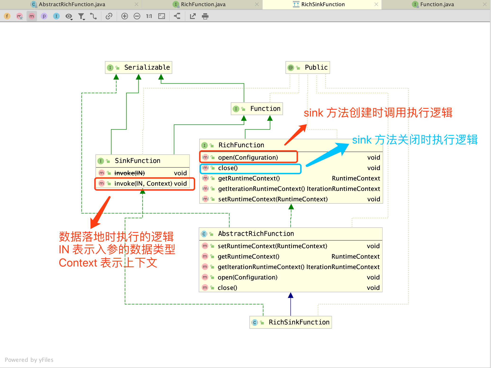
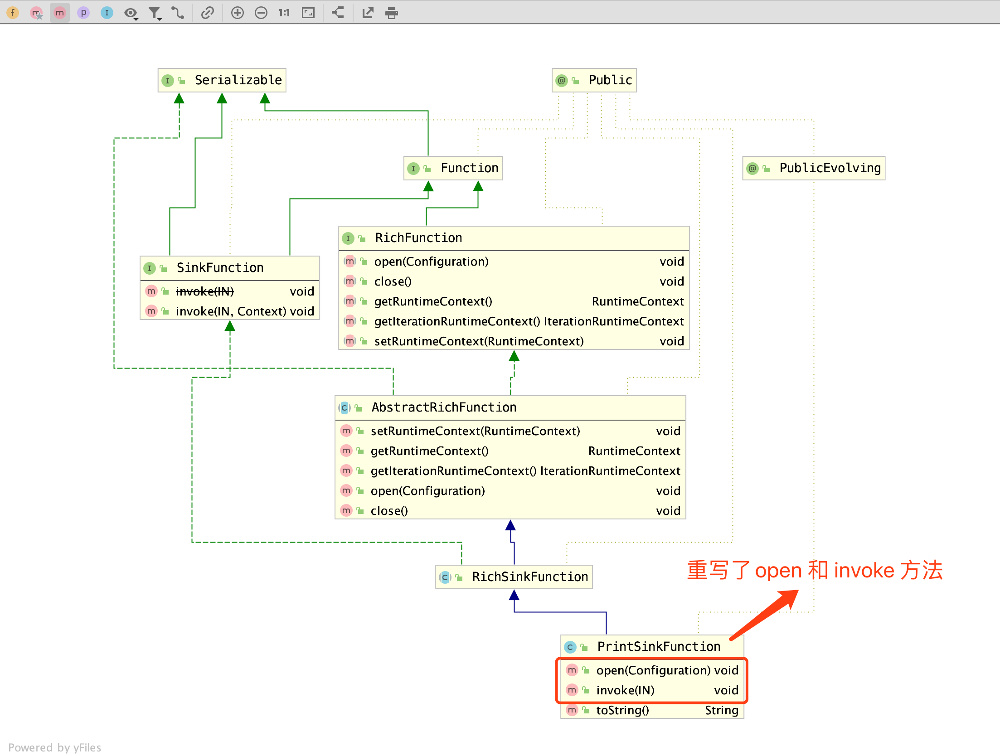
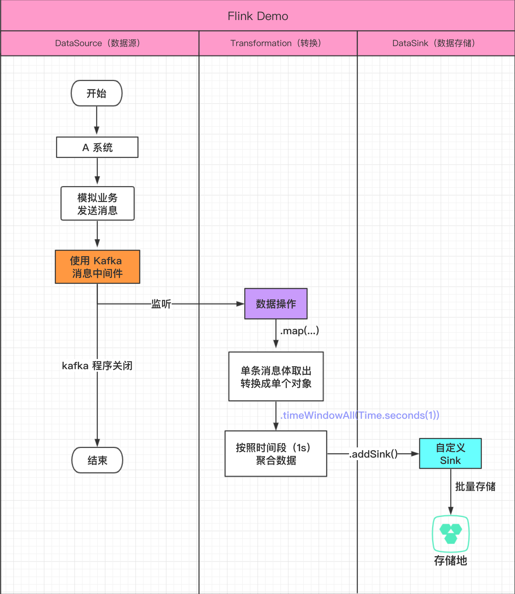
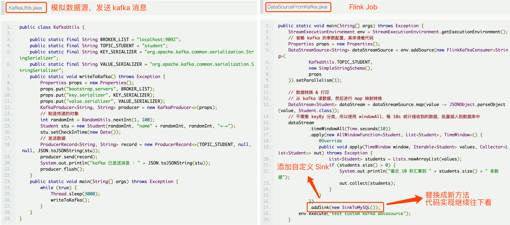
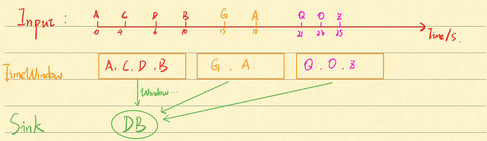
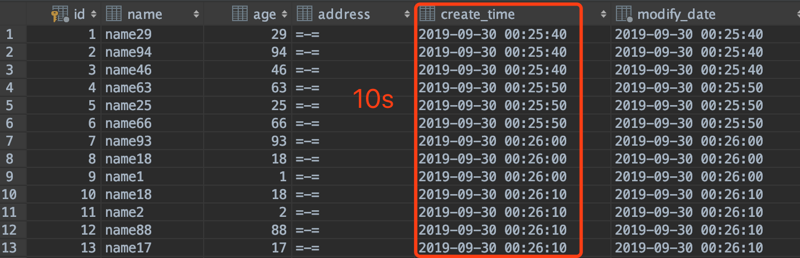

<!-- START doctoc generated TOC please keep comment here to allow auto update -->
<!-- DON'T EDIT THIS SECTION, INSTEAD RE-RUN doctoc TO UPDATE -->
**Table of Contents**  *generated with [DocToc](https://github.com/thlorenz/doctoc)*

- [1 前言](#1-%E5%89%8D%E8%A8%80)
- [2 为什么要用 DataSink](#2-%E4%B8%BA%E4%BB%80%E4%B9%88%E8%A6%81%E7%94%A8-datasink)
- [3 DataSink 是什么](#3-datasink-%E6%98%AF%E4%BB%80%E4%B9%88)
- [4 官方支持的连接器 Connector](#4-%E5%AE%98%E6%96%B9%E6%94%AF%E6%8C%81%E7%9A%84%E8%BF%9E%E6%8E%A5%E5%99%A8-connector)
- [5 PrintSinkFunction](#5-printsinkfunction)
- [6 自定义 SinkFunction（存储到 MySQL）](#6-%E8%87%AA%E5%AE%9A%E4%B9%89-sinkfunction%E5%AD%98%E5%82%A8%E5%88%B0-mysql)
  - [6.1 Demo 流程图](#61-demo-%E6%B5%81%E7%A8%8B%E5%9B%BE)
  - [6.2 Demo 输入输出示意](#62-demo-%E8%BE%93%E5%85%A5%E8%BE%93%E5%87%BA%E7%A4%BA%E6%84%8F)
  - [6.3 SinkToMySQL](#63-sinktomysql)
  - [6.4 项目结构和验证](#64-%E9%A1%B9%E7%9B%AE%E7%BB%93%E6%9E%84%E5%92%8C%E9%AA%8C%E8%AF%81)
- [7 单次操作和聚合操作](#7-%E5%8D%95%E6%AC%A1%E6%93%8D%E4%BD%9C%E5%92%8C%E8%81%9A%E5%90%88%E6%93%8D%E4%BD%9C)
- [8 总结](#8-%E6%80%BB%E7%BB%93)
- [9 项目地址](#9-%E9%A1%B9%E7%9B%AE%E5%9C%B0%E5%9D%80)
- [10 参考资料](#10-%E5%8F%82%E8%80%83%E8%B5%84%E6%96%99)

<!-- END doctoc generated TOC please keep comment here to allow auto update -->


# 1 前言
先来回顾一下 `Flink` 基础的三兄弟：

- 数据来源 `DataSource`
- 数据转换 `Transaformation`
- 数据存储 `DataSink`

前面两篇笔记已经写了数据来源和转换如何使用，那么这篇当然就到了数据存储，接下来将会从以下角度介绍一下（喜闻乐见的 `What` / `Why` / `How`）~：

- 1 为什么要用 `Sink`
- 2 `DataSink` 是什么
- 3 如何使用（进阶使用，滑动时间窗口例子）

<!--more-->

# 2 为什么要用 DataSink

在处理数据的最后一步，一般要进行验证和之后统计，如果没有将计算结果存储下来，后面的操作也很难展开，**所以结果的存储或者更新就显得很必要**。


# 3 DataSink 是什么

`Flink` 基础操作与一个处理数据 `Http` 接口的生命周期很像，**接受数据 -> 处理数据 -> 存储数据**，而 `Sink` 在翻译有表示【下沉】的意思，也就是我们经常对处理数据后做的一件事：**存储**。

下面来看下 `RickSinkFunction` 类的继承体系图：



**个人觉得跟数据源 `RichSourceFunction` 很像，都继承了 `AbstractRichFunction` 抽象类，实现了 `RichFunction` 中的 `open` 和 `close` 等基础方法。两者的区别在于，数据源 `DataSource` 另外实现的是 `SourceFunction` 接口，而我们本篇文章的主角 `DataSink` 实现的就是 `SinkFunction` 接口。**

# 4 官方支持的连接器 Connector

在流式计算框架 `Flink` 中，可以通过 `Sink` 进行存储操作。官方给出更推荐的说法是**连接器 `Connector`， 第三方中间件作为连接器，既可以当成数据源，也能当成目的地，取决于上面提到实现的接口（`SourceFunction`/`SinkFunction`）**

**以下是官方支持的连接器，感兴趣的可以点击参考资料三去详细了解~**

- Apache Kafka (source/sink)
- Apache Cassandra (sink)
- Amazon Kinesis Streams (source/sink)
- Elasticsearch (sink)
- Hadoop FileSystem (sink)
- RabbitMQ (source/sink)
- Apache NiFi (source/sink)
- Twitter Streaming API (source)
- Google PubSub (source/sink)

其中结尾的 `source` 表示数据源，`sink` 表示数据的发送地，例如常见的消息中间件 `Apache Kafka`，**它既可以作为数据源，也能成为数据的发送目的地**。

# 5 PrintSinkFunction

在我们平时编码中，常用的验证结果的方式是**将结果输出到控制台**，例如 `IDEA` 的快捷键 `SOUT`，可以很快的将结果输出到底部控制台中。

在 `Flink` 的世界中，流式计算因为要一直接收数据进行处理，常用的操作对象是 `DataStream`，它是一个流对象，有特定的打印 `Print` 方法，就是我接下来要介绍的 `PrintSinkFunction`。



从结构图看出，`PrintSinkFunction` 继承自 `RichSinkFunction`，重写了其中两个关键方法 `open` 和 `invoke`，在这两个方法中，实现了输出功能。

> PrintSinkFunction.java

```java
public class PrintSinkFunction<IN> extends RichSinkFunction<IN> {

	private final PrintSinkOutputWriter<IN> writer;

    ...

	@Override
	public void open(Configuration parameters) throws Exception {
		super.open(parameters);
		StreamingRuntimeContext context = (StreamingRuntimeContext) getRuntimeContext();
		writer.open(context.getIndexOfThisSubtask(), context.getNumberOfParallelSubtasks());
	}

	@Override
	public void invoke(IN record) {
		writer.write(record);
	}

    ...
}
```

上面是它的核心代码，省略了 `writer` 变量的初始化。

**在 `open` 方法中，获取了运行上下文对象，从中取出当前运行的任务下标以及并发任务数量，传递到了 `writer` 变量中**（所以 `demo` 中经常能看到 【1> xxxx】，前面的数字是一个前缀，实际值是当前任务下标 + 1）。

**在 `invoke` 方法中，做的工作就比较简单了，就是将流处理传入记录 `record` 进行输出打印（详细输出过程可跟踪进 `PrintSinkOutputWriter` 查看）**

官方库中的 `PrintSinkFunction` 在日常开发中常使用，通过控制台输出结果进行验证数据是否跟自己预期的一致。所以先以常用的类进行介绍，可以更快的对 `SinkFunction` 的整体结构有个更清晰的了解。

# 6 自定义 SinkFunction（存储到 MySQL）

除了官方支持的 `Connector` 外，还提供了途径，让我们扩展存储方式，通过 `addSink()` 方法，添加自定义的 `SinkFunction`。

前面都是单独介绍数据源 `DataSource` 和转换 `Transformation`，这次终于将三者串了起来，下面来看下完整的流程，通过例子来说下自定义的存储方法如何实现。


## 6.1 Demo 流程图




上面是 `Demo` 的流程图，一共包含三个模块，其中有两个模块（数据源和转换），在前面的文章 [Flink 基础学习(三)数据源 DataSource]() 已经有详细例子，请参考下图两个核心类的代码编写。



**在主程序中，使用了 `map` 算子进行一对一映射，从单条字符消息转换成应用中的实体对象，接着使用 `timeWindowAll` 算子进行数据的时间窗口聚合，时间窗口大小是 10s，在这个时间段中接收的数据都会在一个窗口中。**

## 6.2 Demo 输入输出示意



**上面是程序的输入和输出示意图**，在 `Input` 中，以秒为单位，`TimeWindow` 以 10s 为间隔，将输入的数据放在一个窗口中（在一个窗口中的数据，可以进行聚合 `reduce` 操作，然后进行输出），**最后 `Sink` 到常用的存储地，这里以 `MySQL` 进行数据的落库作为示例~**

上面每个窗口搜集的数据如下：

- 0-10s: [A, C, D, B]
- 10-20s: [G, A]
- 20-30s: [Q, O, Z]

**最后每次传入 `Sink` 时，是一个数据列表 `List` 型的入参。从上面的示意图来联想我们 `kafka` 消息，搜集 10s 内的消息，然后放入同一个时间窗口中，接着一次性存入到数据库中。**

## 6.3 SinkToMySQL

```java
public class SinkToMySQL extends RichSinkFunction<List<Student>> {

    private PreparedStatement ps;

    private Connection connection;

    @Override
    public void open(Configuration parameters) throws Exception {
        super.open(parameters);
        connection = MyDruidUtils.getConnection();
        String sql = "insert into student(name, age, address) values (?, ?, ?);";
        ps = connection.prepareStatement(sql);
    }

    @Override
    public void close() throws Exception {
        super.close();
        if (connection != null) {
            connection.close();
        }
        if (ps != null) {
            ps.close();
        }
    }

    @Override
    public void invoke(List<Student> value, Context context) throws Exception {
        for (Student student : value) {
            ps.setString(1, student.getName());
            ps.setInt(2, student.getAge());
            ps.setString(3, student.getAddress());
            ps.addBatch();
        }
        int[] count = ps.executeBatch();
    }
}
```

**上面的类就是自定义的 `Sink` 具体实现， `open` 获取数据库链接和初始化 `SQL`， `close` 时释放链接，每次落库具体操作在 `invoke` 方法中。**

## 6.4 项目结构和验证

具体的有三个核心类：

- **模拟数据源：KafkaUtils.java**
- **Flink Job：DataSourceFromKafka.java**
- **自定义 Sink：SinkToMySQL.java**

由于有些代码之前文章也贴过了，就不重复展示，如果对于代码有疑惑的，请参考 `demo` 工程
[https://github.com/Vip-Augus/flink-learning-note](https://github.com/Vip-Augus/flink-learning-note)

数据库建表语句：

```sql
create table test.student
(
	id int auto_increment
		primary key,
	name varchar(20) null,
	age int(3) null,
	address varchar(120) null,
	create_time timestamp default CURRENT_TIMESTAMP null,
	modify_date datetime default CURRENT_TIMESTAMP not null on update CURRENT_TIMESTAMP comment '修改时间'
)charset=utf8;
```

编写好代码以及数据库创表，**在启动 `KafkaUtils` 和 `DataSourceFromKafka` 两个程序（点击 main 方法就能启动啦）之前**，请一定要记得启动 `Zookeeper` 和 `Kafka`，遗忘的话请回顾一下 [Flink 基础学习(三)数据源 DataSource]() ~

最后我们去数据库验证落库结果：



从数据的创建时间上，10s 的时间窗口操作得到了成功验证。

# 7 单次操作和聚合操作

在 `RichSinkFunction<IN>` 类中， `IN` 是一个泛型参数，表示我们传入的参数可以自定义。

在前面简单的 `map` 一对一映射后，得到的输出也是单个的，`IN` 是 `Student` 类型；而在 `timedWindowAll` 时间窗口后，输出的一个 List`<`Student`>` 类型。

如果是单个对象，每次处理一个对象后都要进行一次落库，也就是每次都得获取一次数据库链接，在这种情况下，如果消息特别多，并发发送了成千上万条消息，数据库很可能就无法承受这么大的 `QPS`。

**所以推荐使用的是 `List` 类型的批量操作，通过一定规则（时间窗口或者计数窗口）聚合一批数据，然后一次性插入多条记录，减少数据库的频繁操作，尽可能提高数据库的高可用。**

当然，如果是进行单次操作，只需要更换一下入参 `IN` 类型以及 `invoke` 方法的实现，然后在 `addSink` 方法前，进行的算子操作也改成单个操作的就能实现**单次操作**。

# 8 总结

本次介绍了 `DataSink` 数据存储的基础概念和如何进行自定义扩展存储方法。比较了单次操作和聚合操作，更推荐使用聚合操作。

**参考上面的例子，小伙伴们可以更换落库的目的地，通过修改 `invoke` 方法实现，将数据存储到自己业务上更合适的地方~**

# 9 项目地址

[https://github.com/Vip-Augus/flink-learning-note](https://github.com/Vip-Augus/flink-learning-note)

```sh
git clone https://github.com/Vip-Augus/flink-learning-note
```

# 10 参考资料

1. [Flink 从 0 到 1 学习 —— Data Sink 介绍](http://www.54tianzhisheng.cn/2018/10/29/flink-sink/)
2. [Flink 从 0 到 1 学习 —— 如何自定义 Data Sink ？](http://www.54tianzhisheng.cn/2018/10/31/flink-create-sink/)
3. [Bundled Connectors](https://ci.apache.org/projects/flink/flink-docs-release-1.9/dev/connectors/)


