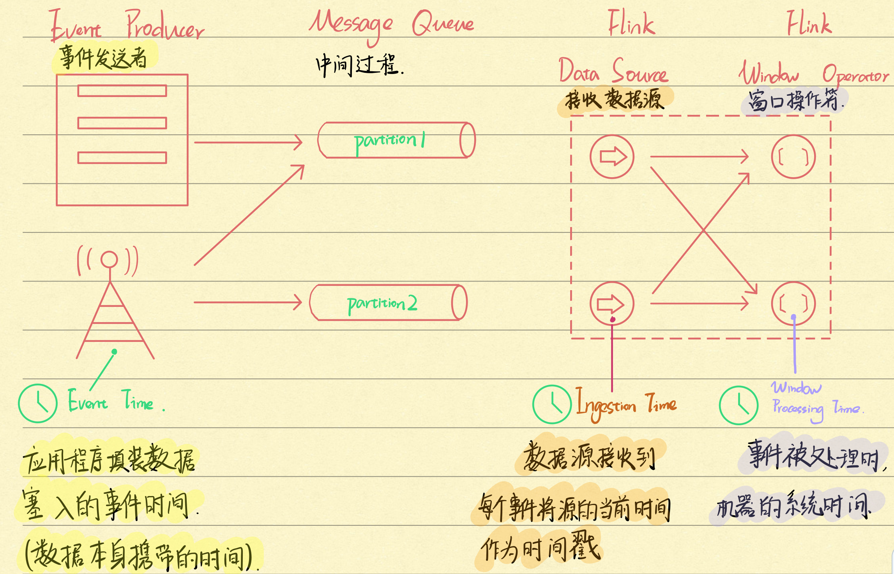

<!-- START doctoc generated TOC please keep comment here to allow auto update -->
<!-- DON'T EDIT THIS SECTION, INSTEAD RE-RUN doctoc TO UPDATE -->
**Table of Contents**  *generated with [DocToc](https://github.com/thlorenz/doctoc)*

- [Time](#time)
  - [Processing Time 处理时间](#processing-time-%E5%A4%84%E7%90%86%E6%97%B6%E9%97%B4)
  - [Event Time 事件时间](#event-time-%E4%BA%8B%E4%BB%B6%E6%97%B6%E9%97%B4)
  - [Ingestion Time 摄取时间](#ingestion-time-%E6%91%84%E5%8F%96%E6%97%B6%E9%97%B4)
- [设置时间属性](#%E8%AE%BE%E7%BD%AE%E6%97%B6%E9%97%B4%E5%B1%9E%E6%80%A7)
- [Event Time and Watermarks](#event-time-and-watermarks)
  - [乱序事件场景](#%E4%B9%B1%E5%BA%8F%E4%BA%8B%E4%BB%B6%E5%9C%BA%E6%99%AF)
  - [Event Time 和 Watermark 的关系](#event-time-%E5%92%8C-watermark-%E7%9A%84%E5%85%B3%E7%B3%BB)
  - [Watermark 图示](#watermark-%E5%9B%BE%E7%A4%BA)
- [并行流中的 Watermark](#%E5%B9%B6%E8%A1%8C%E6%B5%81%E4%B8%AD%E7%9A%84-watermark)
- [延迟的元素](#%E5%BB%B6%E8%BF%9F%E7%9A%84%E5%85%83%E7%B4%A0)
- [Watermark 实际使用例子](#watermark-%E5%AE%9E%E9%99%85%E4%BD%BF%E7%94%A8%E4%BE%8B%E5%AD%90)
- [总结](#%E6%80%BB%E7%BB%93)
- [项目地址](#%E9%A1%B9%E7%9B%AE%E5%9C%B0%E5%9D%80)
- [参考资料](#%E5%8F%82%E8%80%83%E8%B5%84%E6%96%99)

<!-- END doctoc generated TOC please keep comment here to allow auto update -->


前面的例子中有出现过 **时间窗口 `TimeWindow`** 这个词语，其实是两个概念，时间 `Time` 和窗口 `Window`。

本篇文章比较干货，主要翻译自官网（参考资料一）， 来讲下关于 `Time` 的学习、理解以及配套的概念 `Watermark`。

**`Watermark` 有两种译法：水位线、水印。由于个人暂时分不清，所以后面一律以英文 `Watermark` 出现**

<!--more-->

---

# Time

一共有三种时间类型：`Processing Time`、`Event Time` 和 `Ingestion Time`



图片参考官网，加上了一些注释配合理解，三种时间类型对应了三个发生位置，下面具体说下三种时间类型的区别。

---
## Processing Time 处理时间

**`Processing Time`是指事件正在执行所在机器（部署应用服务器）的系统时间。**

当流式程序在 `Processing Time` 上运行时，所有基于时间的操作（如时间窗口）都将使用运行相应算子 `Operator` 所在计算机的系统时钟。

每小时 `Processing Time` 窗口将包括系统时钟指示整小时的时间之间到达特定操作员的所有记录。例如，如果应用程序在 9:15 am开始运行，则第一个每小时处理 `Processing Time` 将包括在 9:15 am 和 10:00 am 之间处理的事件，下一个窗口将包括在 10:00 am 和 11:00 am 之间处理的事件，依此类推。

**`Processing Time` 是最简单的时间概念，不需要流和机器之间的协调。它提供了最佳的性能和最低的延迟。但是，在分布式和异步环境中，`Processing Time` 不能提供确定性，因为它容易受到记录到达系统（例如从消息队列）到达系统的速度，记录在系统内部操作员之间流动的速度的影响，以及中断（计划的或其他方式）。**

---
## Event Time 事件时间

**`Event Time` 是每个事件在其生产设备 `Event producer` 上发生的时间。**

该时间通常在它们进入 `Flink` 之前嵌入到记录中，并且可以从每个记录中提取事件时间戳。 （可以想象成它是数据本身的一个属性，它的值保存的是时间）

在 `Event Time` 中，时间值取决于数据，而不取决于系统时间。 `Event Time` 程序必须指定如何生成 `Event Time` 的 `Watermark`，这是表示 `Event Time` 进度的机制。 

---
## Ingestion Time 摄取时间

**`Ingestion Time` 是事件进入Flink的时间。**

在源操作处，每条记录都将源的当前时间作为时间戳记，并且基于时间的操作（例如时间窗口）引用该时间戳记。

**`Ingestion Time` 从概念上讲介于事件时间和处理时间之间。** 

与 `Processing Time` 相比，它稍微贵一点（翻译的时候有点懵，应该是程序计算资源花费会增加，因为相比于前面两种类型，它会自动分配 `Watermark`），但结果却更可预测。 

由于 `Ingestion Time` 使用稳定的时间戳（在源处分配了一次），因此对记录的不同窗口操作将引用相同的时间戳，而在 `Processing Time` 中，每个窗口的算子 `Operator` 都可以将记录分配给不同的窗口（基于本地系统时间和到达延误）。

与 `Processing Time` 相比，`Ingestion Time` 程序无法处理任何乱序事件或延迟数据，但程序无需指定如何生成 `Watermark`。

在内部，将 `Ingestion Time` 视为事件发生的时间，它具有自动分配时间戳和自动生成 `Watermark` 的功能。

---
# 设置时间属性

**`Setting a Time Characteristic`**

前面介绍了三种时间属性的概念和区别，下面来看下在实际中如何应用：

**在 `Flink DataStream` 程序的起始步骤，通常设置基准时间特征。**

该设置定义数据流源的行为方式（例如，它们是否将分配时间戳），以及诸如 `KeyedStream.timeWindow(Time.seconds(30))` 之类的窗口操作应使用什么时间概念。

以下示例显示了一个 `Flink` 程序，该程序统计时间窗口（每小时）事件。 窗口的行为与时间特征相适应。

```java
final StreamExecutionEnvironment env = StreamExecutionEnvironment.getExecutionEnvironment();
env.setStreamTimeCharacteristic(TimeCharacteristic.ProcessingTime);
// 另外可选:
// env.setStreamTimeCharacteristic(TimeCharacteristic.IngestionTime);
// env.setStreamTimeCharacteristic(TimeCharacteristic.EventTime);
DataStream<MyEvent> stream = env.addSource(new FlinkKafkaConsumer09<MyEvent>(topic, schema, props));

stream
    .keyBy( (event) -> event.getUser() )
    .timeWindow(Time.hours(1))
    .reduce( (a, b) -> a.add(b) )
    .addSink(...);
```

请注意，为了在事件时间中运行上面示例程序，程序需要使用直接为数据定义 `Processing Time` 并自己设定 `Watermark` 的生成规则，或者程序必须在源之后注入 `Timestamp Assigner` ＆ `Watermark Generator` 。这些功能描述了如何访问事件时间戳，以及事件流呈现出何种程度的乱序。

---
# Event Time and Watermarks

在为什么使用事件时间和 `Watermark` 这个问题上，引用了参考资料三的描述

> 在进行 window 计算时，使用摄入时间或处理时间的消息都是以系统的墙上时间（wall clocks）为标准，因此事件都是按序到达的。
>
> 然而如果使用更为有意义的事件时间则会需要面对乱序事件问题（out-of-order events）和迟到事件问题（late events）。
>
> 针对这两个问题，Flink 主要采用了以水位线（watermark）为核心的机制来应对。

通过上面的描述，应该能对 `Watermark` 要解决的问题有个清晰的了解：**解决乱序事件**

---
## 乱序事件场景

如果数据源是 `kafka` 消息数据源，按照事件时间 `Event Time` 来统计，在理想情况下，消息按照事件顺序依次到达，时间窗口刚好收集的该时间段的事件，但很可惜，由于不可预估的外力阻挠，导致消息延迟，时间窗口内的数据将会少了延迟到达的事件。

**所以使用 `Watermark` 来记录事件进行的进度，用收集到的消息来评估事件进度，判断还有没有事件没有到达，只有 `Watermark` 越过了时间窗口设定的时间，才认为窗口已经收集好数据**

举个具体一点的例子，设定了一个 3s 的时间窗口还有 10s 的乱序延时：

```java
long maxUnOrderWatermark = 10000L;
// watermark 设定成 当前时间戳 - 延时
new Watermark(currentTimeStamp - maxUnOrderWatermark);
```

在 [00:01 : 00:03] 窗口时间过去后，搜集到了 3 个时间，但是窗口先不触发计算，等待有可能延迟的事件。

例如在 06s 又有一个前面窗口的事件到来，由于在设定的延时时间内，它会被分配到正确窗口中，窗口中的元素变成了 4 个，然后在后续有新事件来临，`watermark` 被更新成大于 00:03，**这时 `Watermark` > 窗口结束时间，触发窗口计算，解决了事件延时到达的问题。**

---
## Event Time 和 Watermark 的关系

**支持 `Event Time` 的流处理器需要一种测量 `Event Time` 进度的方法（`Watermark`）。例如，当事件时间超过一个小时结束时，需要通知构建每小时窗口的 `Operator`，以便该 `Operator` 可以关闭正在进行的窗口。**

`Event Time`  可以独立于 `Processing Time`（由系统时间测量）进行。例如，在一个程序中，`operator` 的当前 `Event Time` 可能会稍微落后于 `Processing Time`（考虑到事件接收的延迟），而两者均以相同的速度进行。 另一方面，另一个流媒体程序可以通过快速转发已经在 `Kafka Topic` 主题（或另一个消息队列）中缓存的一些历史数据来在数周的事件时间内进行处理，而处理时间仅为几秒钟。

---
## Watermark 图示

**`Flink` 中用于衡量事件时间进度的机制是水印 `Watermark`。 `Watermark` 作为数据流的一部分流动，并带有时间戳 `t`。 `Watermark(t)` 声明事件时间已在该流中达到时间 `t`，这意味着该流中不应再有时间戳 `t'<= t` 的元素（即时间戳早于或等于 `Watermark` 的事件）。**

下图显示了带有（逻辑）时间戳记的事件流，以及串联的 `Watermark`。 在此示例中，事件是按顺序（`In Order`）排列的（相对于其时间戳），这意味着 `Watermark` 只是流中的周期性标记。


**`Watermark` 对于乱序流（`Out Of Order`）至关重要，如下图所示，其中事件不是按其时间戳排序的。** 通常，`Watermark` 是一种声明，即到流中的那个点，直到某个时间戳的所有事件都应该到达。一旦 `Watermark` 到达 `Operator`，`Operator` 就可以将其内部事件时钟提前到 `Watermark` 的值。


> 请注意，`Evnet Time` 是由新创建的一个（或多个）流元素从产生它们的事件或触发了创建这些元素的 `Watermark` 中继承的。

---
# 并行流中的 Watermark

`Watermark` 在源函数处或源函数之后直接生成。源函数的每个并行子任务通常独立生成其水印。 这些水印定义了该特定并行源处的事件时间。

随着 `Watermark` 在流媒体程序中的流动，它们会提前到达其到达的 `Operator` 的 `Event Time`。 每当 `Operator` 提前其事件时间时，都会为其后续 `Operator` 在下游生成新的 `Watermark`。

一些运算符消费多个输入流；例如，并集 `union`、键控 `keyBy(…)` 或分区 `partition(…)` 函数的运算符。这样的 `Operator` 的当前事件时间是其输入流的事件时间中的最小值。 随着其输入流更新其事件时间，`Operator` 也将更新。

下图显示了流过并行流的事件和 `Watermark` 的示例，`Operator` 跟踪事件时间。


（并行流用的不多，这里留个坑吧，待之后用到再来补=-=）

---
# 延迟的元素

某些元素可能会违反 `Watermark` 条件，这意味着即使在发生 `Watermark(t)` 之后，也会出现更多时间戳为 `t'<= t` 的元素。实际上，在许多现实世界的设置中，某些元素可以任意延迟，从而无法指定某个事件时间戳记的所有元素都将发生的时间。此外，即使可以限制延迟，通常也不希望将 `Watermark` 延迟太多，因为这会导致事件时间窗的评估延迟过多。

由于这个原因，流式传输程序可能会明确期望某些延迟元素。延迟元素是指系统的事件时间时钟（由 `Watermark` 指示）在经过延迟元素时间戳之后的时间到达的元素。有关如何在事件时间窗口中使用延迟元素的更多信息，请参见[允许延迟](https://ci.apache.org/projects/flink/flink-docs-release-1.9/dev/stream/operators/windows.html#allowed-lateness)。

---
# Watermark 实际使用例子

1. [Generating Timestamps / Watermarks](https://ci.apache.org/projects/flink/flink-docs-release-1.9/dev/event_timestamps_watermarks.html)
2. [Flink Watermark 机制浅析](https://www.whitewood.me/2018/06/01/Flink-Watermark-%E6%9C%BA%E5%88%B6%E6%B5%85%E6%9E%90/)

**看了这两篇文章后，能对 `Watermark` 的设置有个基础的了解，在实际场景中，需要评估下面两者：定期 `Watermark`或标点 `Watermark`，了解两者差别后才使用。**

---
# 总结

本篇主要讲了三种时间类型：`Processing Time`、`Event Time` 和 `Ingestion Time`，了解了它们所发生的位置，三者的使用差别，以及 `Watermark` 与 事件时间 `Event Time` 的关系，可以使用 `Watermark` 来解决乱序的事件流，请参考实际使用例子的链接，调整算法来达到你所需要解决的实际场景~

以及本篇时间 `Time` 的介绍有点“太干”，学起来有点费力，如有其它学习建议或文章不对之处，请与我联系~

---
# 项目地址

[https://github.com/Vip-Augus/flink-learning-note](https://github.com/Vip-Augus/flink-learning-note)

```sh
git clone https://github.com/Vip-Augus/flink-learning-note
```

---
# 参考资料

1. [Event Time](https://ci.apache.org/projects/flink/flink-docs-release-1.9/zh/dev/event_time.html)
2. [Flink 从 0 到 1 学习 —— Flink 中几种 Time 详解](http://www.54tianzhisheng.cn/2018/12/11/Flink-time/)
3. [Flink Watermark 机制浅析](https://www.whitewood.me/2018/06/01/Flink-Watermark-%E6%9C%BA%E5%88%B6%E6%B5%85%E6%9E%90/)
4. [Flink 小贴士 (3): 轻松理解 Watermark](http://wuchong.me/blog/2018/11/18/flink-tips-watermarks-in-apache-flink-made-easy/)
5. [Generating Timestamps / Watermarks](https://ci.apache.org/projects/flink/flink-docs-release-1.9/dev/event_timestamps_watermarks.html)
6. [允许延迟](https://ci.apache.org/projects/flink/flink-docs-release-1.9/dev/stream/operators/windows.html#allowed-lateness)


