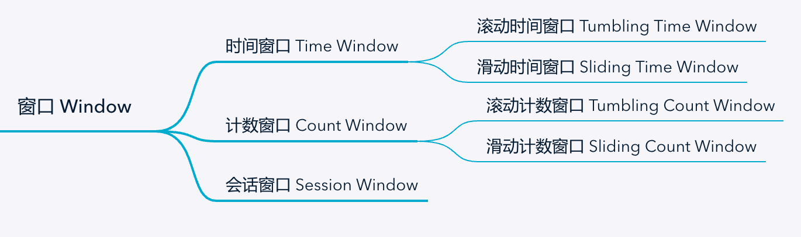
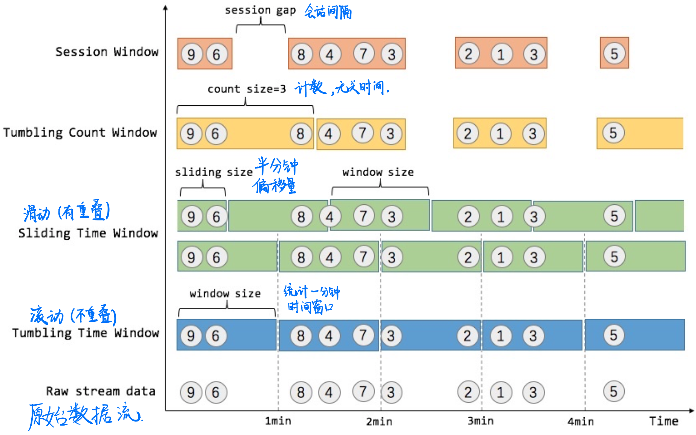
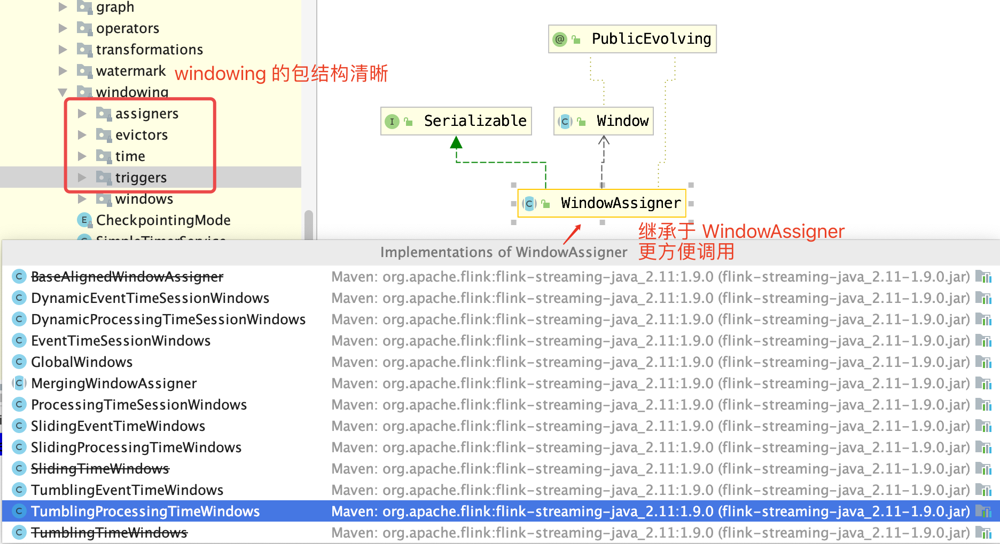
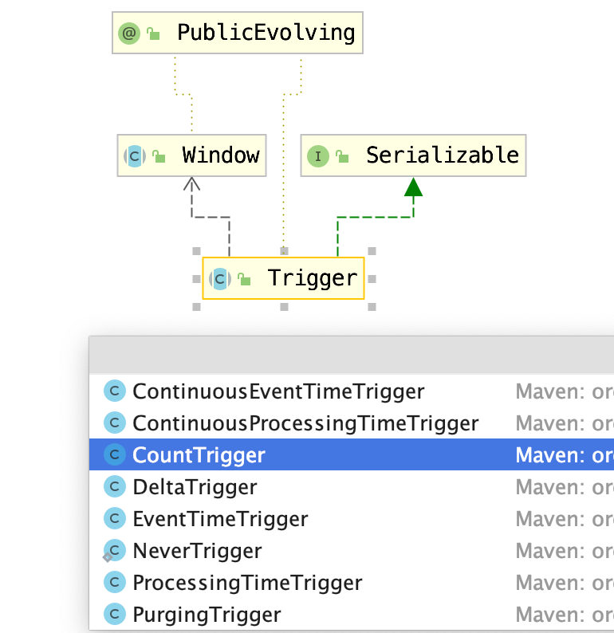
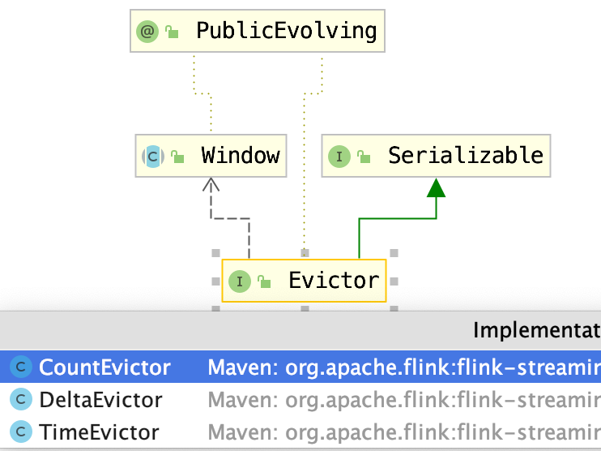
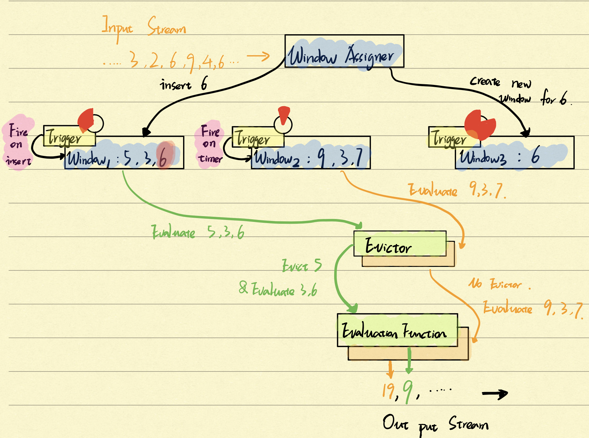
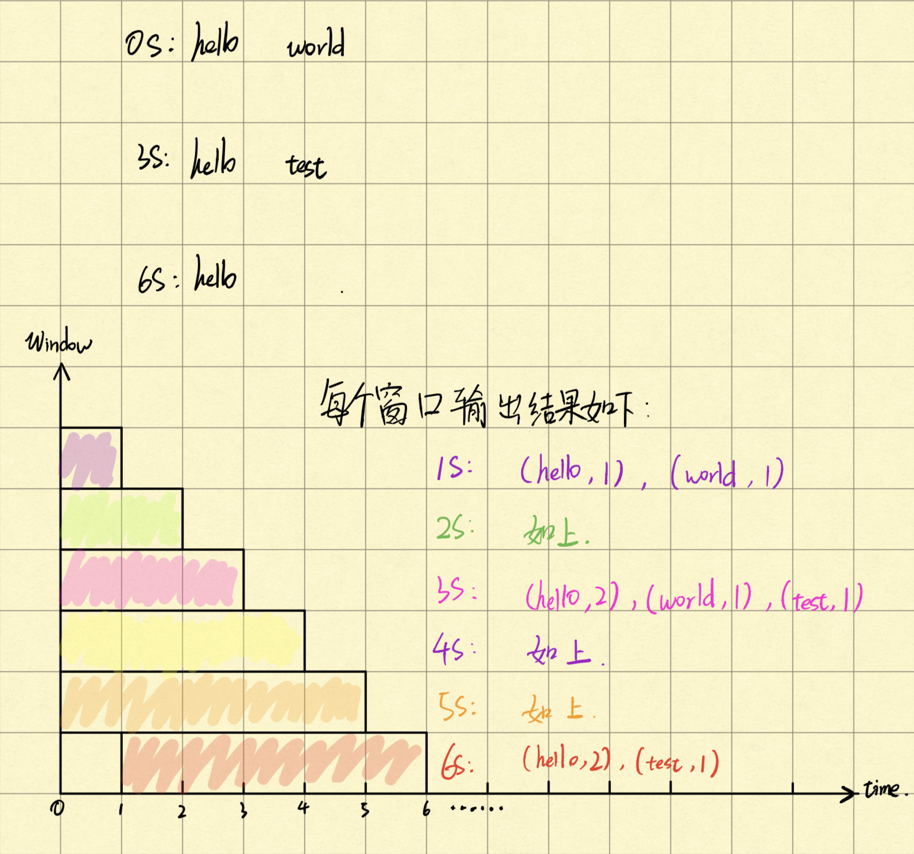

<!-- START doctoc generated TOC please keep comment here to allow auto update -->
<!-- DON'T EDIT THIS SECTION, INSTEAD RE-RUN doctoc TO UPDATE -->
**Table of Contents**  *generated with [DocToc](https://github.com/thlorenz/doctoc)*

- [前言](#%E5%89%8D%E8%A8%80)
- [Window 窗口是什么](#window-%E7%AA%97%E5%8F%A3%E6%98%AF%E4%BB%80%E4%B9%88)
- [Window 按驱动类型分类](#window-%E6%8C%89%E9%A9%B1%E5%8A%A8%E7%B1%BB%E5%9E%8B%E5%88%86%E7%B1%BB)
  - [Time Windows](#time-windows)
    - [Tumbling Time Window 滚动时间窗口](#tumbling-time-window-%E6%BB%9A%E5%8A%A8%E6%97%B6%E9%97%B4%E7%AA%97%E5%8F%A3)
    - [Sliding Time Window  滑动时间窗口](#sliding-time-window--%E6%BB%91%E5%8A%A8%E6%97%B6%E9%97%B4%E7%AA%97%E5%8F%A3)
  - [CountWindows](#countwindows)
    - [Tunmling Count Window](#tunmling-count-window)
    - [Sliding Count Window](#sliding-count-window)
  - [Session Window](#session-window)
- [Window 开放的三大核心 API](#window-%E5%BC%80%E6%94%BE%E7%9A%84%E4%B8%89%E5%A4%A7%E6%A0%B8%E5%BF%83-api)
  - [Window Assigner](#window-assigner)
  - [Trigger](#trigger)
  - [Evictor](#evictor)
- [剖析 Window 实现机制](#%E5%89%96%E6%9E%90-window-%E5%AE%9E%E7%8E%B0%E6%9C%BA%E5%88%B6)
- [使用例子](#%E4%BD%BF%E7%94%A8%E4%BE%8B%E5%AD%90)
- [总结](#%E6%80%BB%E7%BB%93)
- [项目地址](#%E9%A1%B9%E7%9B%AE%E5%9C%B0%E5%9D%80)
- [参考资料](#%E5%8F%82%E8%80%83%E8%B5%84%E6%96%99)

<!-- END doctoc generated TOC please keep comment here to allow auto update -->

# 前言

前面讲了时间 `Time` 的概念和实际解决问题后，本篇来看下经常搭配使用的另一个关键工具：窗口 `Window`。

窗口也有三种类型可供选择使用：

- **Tumbling Windows：滚动窗口**
- **Sliding Windows：滑动窗口**
- **Session Windows：会话窗口**

友情提示，本篇主要翻译自官网以及参考了 `wuchong` 大神的博客，内容比较干货，介绍这三种窗口的概念以及使用场景，希望看完能对 `Flink` 的窗口概念加深理解。

<!--more-->

# Window 窗口是什么

`Windows` 是处理无限流的核心。`Windows` 将流分成有限大小的“存储桶”，我们可以在其上应用计算。**`Flink` 是一个优秀的流计算引擎，数据是源源不断的，它认为批处理 `Batch` 是一种特殊的流计算，在流中分割出一个个窗口，每个窗口相当于有限大小的空间，汇聚了待处理的数据。**

窗口式 `Flink` 程序的一般结构如下所示。第一个片段指的是键控流，第二个片段指的是非键控流。可以看到，唯一的区别是对键控流的 `keyBy(...)` 调用和对非键控流的 `window(...)` 变为 `windowAll(...)`。

- Keyed Windows 键控流

```java
stream
    .keyBy(...)                <-  keyed versus non-keyed windows
    .window(...)               <-  required: "assigner"
    [.trigger(...)]            <-  optional: "trigger" (else default trigger)
    [.evictor(...)]            <-  optional: "evictor" (else no evictor)
    [.allowedLateness(...)]    <-  optional: "lateness" (else zero)
    [.sideOutputLateData(...)] <-  optional: "output tag" (else no side output for late data)
    .reduce/aggregate/fold/apply()      <-  required: "function"
    [.getSideOutput(...)]      <-  optional: "output tag"
```

- Non-Keyed Windows 非键控流

```java
stream
    .windowAll(...)            <-  required: "assigner"
    [.trigger(...)]            <-  optional: "trigger" (else default trigger)
    [.evictor(...)]            <-  optional: "evictor" (else no evictor)
    [.allowedLateness(...)]    <-  optional: "lateness" (else zero)
    [.sideOutputLateData(...)] <-  optional: "output tag" (else no side output for late data)
    .reduce/aggregate/fold/apply()      <-  required: "function"
    [.getSideOutput(...)]      <-  optional: "output tag"
```

---
# Window 按驱动类型分类



上图按照不同驱动类型，将窗口分成三类。

- **时间驱动（Time Window，例如：每 10 秒钟）**
- **数据驱动（Count Window，例如： 搜集到 100 个事件）**
- **会话窗口（Session Window，一次会话中搜集到的事件）**

再往下细分，**分成了滚动窗口（Tumbling Window，窗口没有重叠）和滑动窗口（Sliding Window，窗口会有重叠的部分）**

所以

这里引用 `wuchong` 博客中关于 `Window` 的介绍

> **我们举个具体的场景来形象地理解不同窗口的概念。假设，淘宝网会记录每个用户每次购买的商品个数，我们要做的是统计不同窗口中用户购买商品的总数。下图给出了几种经典的窗口切分概述图（圈中的数字代表该用户本次购买的商品个数）：**



从上图能够看出，`Raw stream data` 是原始数据流，数据输入方向为【从左到右】，根据左侧不同的窗口分类，将会得到右边相应的窗口，依据设定的窗口大小和时间间隔，每个窗口将会搜集到相应的数据（一个颜色块表示一个窗口）。

下面将分别介绍这三种窗口类型，其中计数 `Count` 和时间 `Time` 窗口可以选择使用滚动 `Tumbling` 或滑动 `Sliding` 功能，区别在于统计窗口计算的触发时机和窗口是否有重叠。

---
## Time Windows

顾名思义，`Time Window` 按时间分组流元素。例如，一分钟的滚动时间窗口将收集一分钟的元素，并在一分钟后将功能应用于窗口中的所有元素。

在前面的文章中讲过 `Flink` 中的时间概念，分别是 `Event Time` 事件时间、`Processing Time` 处理时间和 `Ingestion Time` 注入时间，其中 `Event Time` 可能引起的乱序事件，使用 `Watermark` 去兼容处理，在 `Flink` 中，时间类型和窗口机制是解耦的，所以设定不同的时间类型，不需要修改窗口的计算逻辑，就能达到想要的计算结果。

### Tumbling Time Window 滚动时间窗口

例如下面例子中，表示搜集 5s 内的事件，做统计 `sum` 计算。

```java
DataStream<T> input = ...;
// 时间属性的设定，EventTime 模式，用基于数据中自带的时间戳
env.setStreamTimeCharacteristic(TimeCharacteristic.EventTime);
input
    .keyBy(<key selector>)
    .window(TumblingEventTimeWindows.of(Time.seconds(5)))
    .sum(1);
```

**在上面时间属性的设定 `TimeCharacteristic.EventTime`，需要与后面算子 `window` 操作的 `TumblingEventTimeWindows.of(Time.seconds(5))` 保持一致。后面例子中，将会省去时间属性的设定，贴出核心的代码**

### Sliding Time Window  滑动时间窗口

有时候我们会需要每 5min 后，统计前面 60min 内事件的聚合值。

这时需要滑动窗口，保存上一次时间窗口的输入值，给下一个窗口使用重叠的部分。所以一个数据在滑动窗口中，可以出现在多个窗口中。

```java
DataStream<ItemViewCount> windowData = pvData
    .keyBy("itemId")
    .timeWindow(Time.minutes(60), Time.minutes(5))
    .aggregate(new CountAgg(), new WindowResultFunction());
```

---
## CountWindows

`Apache Flink` 还具有计数窗口。滚动计数窗口为 100 时，将在一个窗口中收集 100 个事件，并在添加第 100 个元素时触发该窗口的计算。

在 `DataStream API` 中，滚动和滑动计数窗口的定义如下：

### Tunmling Count Window

例如每次想要统计 100 个事件的合计值，只要从数据源处，累加满 100 个事件就触发计算，可以使用下面的 `API`

```java
 DataStream<WordWithCount> windowCounts = text
    .flatMap(...)
    .keyBy("word")
    .countWindow(100)
    .sum(1);
```

### Sliding Count Window

在一些场景下，有可能来了 5 个数据后，要统计前 100 个数据的合计值，每个数据可以被分配到多个窗口中，那么就可以使用滑动窗口实现。

```java
 DataStream<WordWithCount> windowCounts = text
    .flatMap(...)
    .keyBy("word")
    .window(SlidingEventTimeWindows.of(5, 100)
    .sum(1);
```

---
## Session Window

`Session Window` 会话窗口分配器 `Assigner` 按活动会话对元素进行分组。

**与 `Tumbling` 滚动窗口和 `Sliding` 滑动窗口相比，会话窗口不重叠且没有固定的开始和结束时间。**

相反，当会话窗口在一定时间段内未接收到元素时，即在发生不活动间隙时，它将关闭。会话窗口分配器可以配置有静态会话间隔，也可以配置有会话间隔提取器功能，该功能定义不活动的时间长度。 当此时间段到期时，当前会话将关闭，随后的元素将分配给新的会话窗口。

```java
DataStream<T> input = ...;
input
    .keyBy(<key selector>)
    .window(EventTimeSessionWindows.withGap(Time.minutes(10)))
    .<windowed transformation>(<window function>);
```

其中，`withGap` 方法中的入参，表示会话间隔的大小，表示超过这个时间没有新数据进入，该会话就会关闭，之后的数据就会进入下一个窗口。

---
# Window 开放的三大核心 API

**核心有三个组件：窗口分配器  Window Assigner 、触发器 Trigger、'驱逐者' Evictor，下面来 一一介绍**

## Window Assigner

该组件主要功能是决定数据该分发到哪个窗口，它的作用可以类比于 `Spring MVC` 中的 `Dispatcher`。



上图左侧是 `Flink` 窗口实现的包结构，三大组件在对应的目录下，清晰明了。

底部是 `Window Assigner` 的继承类，在调用 `WindowedStream<T, KEY, W> window(WindowAssigner<? super T, W> assigner)` 这类方法时，可以传入上述的窗口分发器，在里面实现自定义的窗口分发逻辑。

## Trigger

每个窗口都有一个触发器，该触发器决定何时评估或清除该窗口。

对于每个插入到窗口中的元素以及先前注册的计时器超时时，将触发该触发器。



上图展示了触发器的继承类，从中可以看出，它可以根据时间或者计数来触发，表示这个窗口的数据已收集完成，可以触发计算逻辑。

##  Evictor

直译为 ‘驱逐者’，作用类似于过滤器 `fliter`，在 `trigger` 后执行，如果设定了 `evictor`，将会去除不符合条件的数据（默认是不设定的，不会驱逐）



通过这三大组件，可以实现自定义窗口逻辑，决定数据如何分配、何时触发计算以及哪些数据要被提前去除，详细使用例子可以参考官网的示例：https://flink.apache.org/news/2015/12/04/Introducing-windows.html

# 剖析 Window 实现机制

**前面介绍了三大组件，接下来就来看下在实际应用中，它们的流程是如何串起来。**

`Flink` 的内置时间和计数窗口涵盖了各种常见的窗口用例。

但是，当然有些应用程序需要自定义窗口逻辑，而 `Flink` 的内置窗口无法解决这些逻辑。为了也支持需要非常特定的窗口语义的应用程序，`DataStream API` 公开了其窗口机制内部的接口。

这些接口可以非常精细地控制窗口的构建和评估方式。下图描述了 `Flink` 的窗口机制，并介绍了其中涉及的组件。



到达窗口运算符的元素将传递给 `WindowAssigner`。` WindowAssigner` 将元素分配给一个或多个窗口，可能会创建新窗口。窗口本身只是元素列表的标识符，并且可以提供一些可选的元信息，例如在使用 `TimeWindow` 时的开始和结束时间。请注意，可以将元素添加到多个窗口，这也意味着元素可以同时存在于多个窗口（图中的元素 6 就存在于第一个和第三个窗口中）。

每个窗口都有一个触发器 `Trigger`，该触发器决定该窗口何时被计算或清除。对于每个插入到窗口中的元素以及先前注册的计时器超时时，将触发对应的 `Trigger`。

对于每个事件，触发器都可以决定触发（即计算），清除（删除窗口并丢弃其内容），或者触发然后清除窗口。仅触发的触发器会计算窗口并保持其原样，即所有元素保留在窗口中，并在下次触发时再次计算。一个窗口可以被计算多次，并且一直存在，直到被清除为止。请注意，在清除窗口之前，它会一直消耗内存。

触发 `Trigger` 时，可以将窗口元素列表提供给 `Evictor` （如果有的话）。驱逐者可以遍历列表，并决定从列表的开头删除一些元素，即删除一些首先进入窗口的元素。 其余元素进入到下一步计算函数 `Evaluation Function`。 如果未定义 `Evictor`，则触发器将所有窗口元素直接移交给计算函数。

**关于驱逐者 `Evictor`，可以参考绿色线（元素 5 被移除了）和橙色线（没有定义 `Evicotr`，所有元素流入计算函数）。**


`Evaluation Function` 计算函数接收一个窗口的元素（可能由 `Evictor` 过滤），并为该窗口计算一个或多个结果元素。`DataStream API` 接受不同类型的计算函数，包括预定义的聚合函数，例如 `sum（），min（），max（）` 以及 `ReduceFunction`，`FoldFunction` 或 `WindowFunction`。`WindowFunction` 是最通用的计算函数，它接收窗口对象（即窗口的元数据），窗口元素列表以及窗口键（在键控窗口的情况下）作为参数。

以上就是一个完整的窗口计算流程，经历了 `Window Assigner` -> `Trigger` -> `Evictor` -> `Evaluation Function` 的过程，最终获得结果。

---
# 使用例子

这里需要翻出前面写的 [HelloWorld 的例子](https://github.com/Vip-Augus/flink-learning-note/blob/master/note/2019-10-13-flink_learn_hello_world.md)，参考以下 `Demo`

```java
public class SocketWindowWordCount {
    public static void main(String[] args) throws Exception {
        String hostName = "127.0.0.1";
        int port = 9000;
        final StreamExecutionEnvironment env = StreamExecutionEnvironment.getExecutionEnvironment();
        DataStream<String> text = env.socketTextStream("localhost", port, "\n");
        DataStream<WordWithCount> windowCounts = text
                .flatMap(new FlatMapFunction<String, WordWithCount>() {
                    @Override
                    public void flatMap(String value, Collector<WordWithCount> out) {
                        for (String word : value.split("\\s")) {
                            out.collect(new WordWithCount(word, 1L));
                        }
                    }
                })
                .keyBy("word")
                .timeWindow(Time.seconds(5), Time.seconds(1))
                .reduce(new ReduceFunction<WordWithCount>() {
                    @Override
                    public WordWithCount reduce(WordWithCount a, WordWithCount b) {
                        return new WordWithCount(a.getWord(), a.getCount() + b.getCount());
                    }
                });

        // print the results with a single thread, rather than in parallel
        windowCounts.print().setParallelism(1);
        env.execute("Socket Window WordCount");
    }
}
```

打开 9000 端口，往窗口发送数据，程序接收到数据进行解析，接着使用 `timeWindow` 时间窗口搜集数据，窗口大小为 5s，滑动统计的时间间隔为 1s，于是就有了下图的输出结果：



每秒输出当前 5s 内搜集到的数据，时间窗口统计正确运行。


# 总结

`Time` 时间和 `Window` 窗口是 `Flink` 的亮点，所以这两篇对它们的学习是十分必要的，了解它们的概念和原理，可以更好的去使用它们。

`Flink` 是一个流处理器，提供了非常强大的运算符，帮助我们计算、聚合数据。同时提供了窗口机制，将流划分成一个个区间，对于区间，也就是窗口中的元素进行计算，达到批处理的作用。

本篇介绍了 `Window` 是什么，它的分类，滑动窗口 `Sliding` 和滚动窗口 `Tumbling`，时间 `Time` 和计数 `Count` 驱动，介绍了三大核心组件以及 `Window` 的机制，剩下的源码分析，建议小伙伴们去看下 `wuchong` 大神写的分析 ：[Flink 原理与实现：Window 机制](http://wuchong.me/blog/2016/05/25/flink-internals-window-mechanism/)

如有其它学习建议或文章不对之处，请与我联系~（可在 `Github` 中提 `Issue` 或掘金中联系）

---
# 项目地址

[https://github.com/Vip-Augus/flink-learning-note](https://github.com/Vip-Augus/flink-learning-note)

```sh
git clone https://github.com/Vip-Augus/flink-learning-note
```

---
# 参考资料

1. [Flink 原理与实现：Window 机制](http://wuchong.me/blog/2016/05/25/flink-internals-window-mechanism/)
2. [Flink 从 0 到 1 学习 —— 介绍Flink中的Stream Windows](http://www.54tianzhisheng.cn/2018/12/08/Flink-Stream-Windows/)
3. [Windows](https://ci.apache.org/projects/flink/flink-docs-release-1.9/dev/stream/operators/windows.html#windows)
4. [Introducing Stream Windows in Apache Flink](https://flink.apache.org/news/2015/12/04/Introducing-windows.html)


